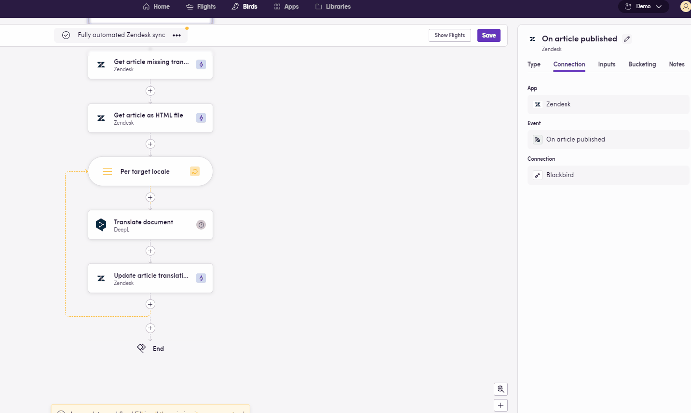
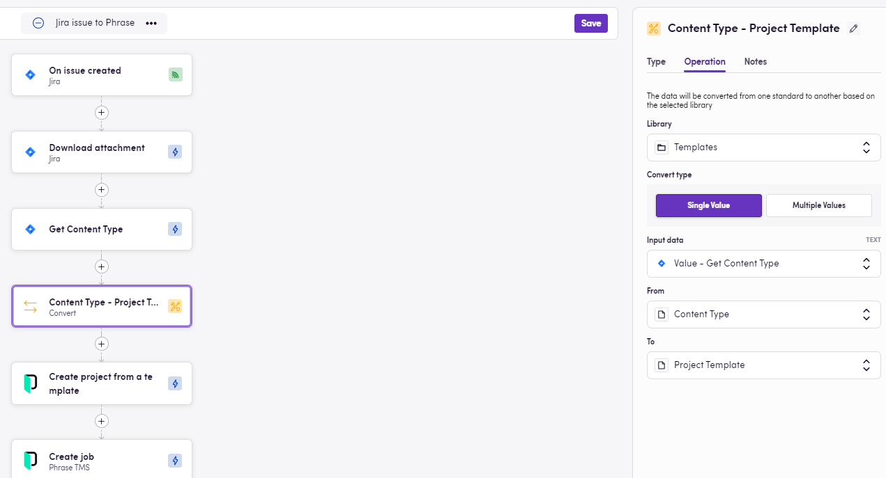
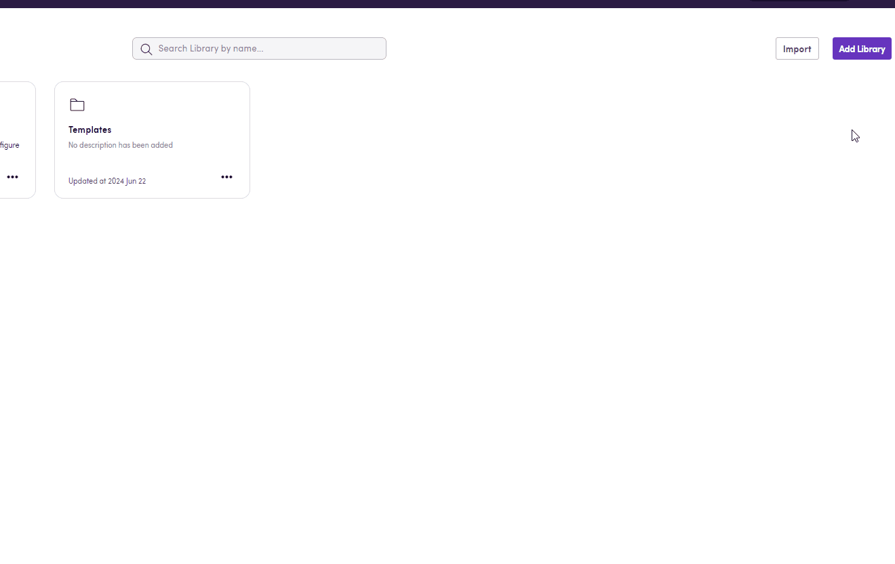
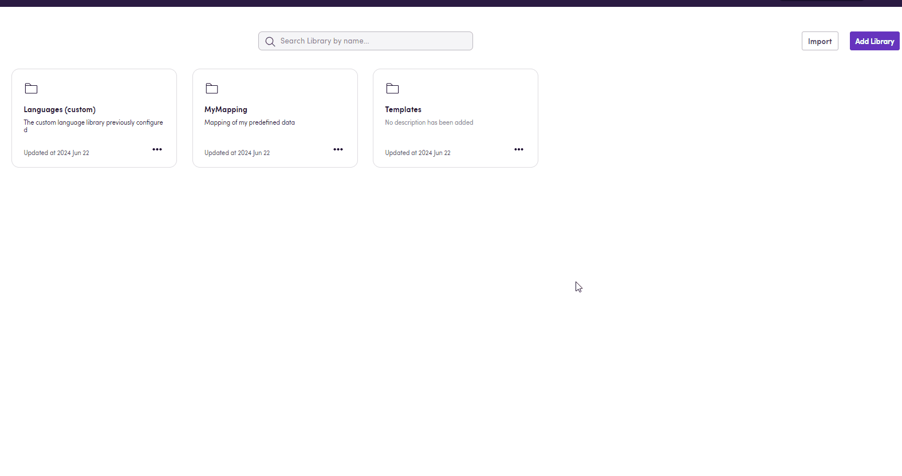

## What is a Library?

In the context of workflows and data management, a "Library" is a structured matrix or table used to map and manage various pieces of information. It serves as a reference that allows you to easily convert one piece of information to another based on predefined mappings. Libraries are particularly useful for organizing and accessing predetermined data that is essential for your workflow.

Similar to a table, libraries contain rows and columns, with each row representing a unique entry and each column representing an attribute or piece of information related to that entry.

Libraries are used to:
- **Organize Data**: Store predefined information in a structured format.
- **Simplify Workflows**: Enable quick lookup and conversion of data based on predefined mappings.
- **Ensure Interoperability**: Convert one tool's output into another tool's input on the fly.

## The Languages Library

In Blackbird, there is a dedicated tab for Libraries (navigation bar at the top right). The default use case is for language codes: even though there are standards, each app uses a different one to refer to the same language. Therefore, we use the default library to store different code variants referring to the same locale across apps.

Within your workflow (Bird), you can reference the library by using the Convert operator. Click on the plus sign, as if you were adding an action, but select Operator instead. Then choose `Convert`, the library to use, and the pieces of data you want to go from and to. Once your Bird is flying (_workflow running_), data gets transformed and routed accordingly.

<!--  -->

Here is one example where the output of one tool becomes the input of the next one, and in between, the Convert operator follows the rules in the library to ensure everything works smoothly in terms of interoperability, even when the two tools use different standards to refer to languages. In this case, we get the list of locales missing a translation for a particular article in Zendesk and we want to translate the articles into these languages through DeepL. However, we know DeepL uses a different code to refer to the same languages. Hence, we set up these codes once in our library, add the Convert operator as part of our workflow, and we have a fully functional Bird now that won't be interrupted because two apps _don't speak the same language_.

While the default Library is read-only, you can create your own custom libraries.

## Custom Libraries

While you can benefit from using the Languages library, you can also create one (or several) libraries to map information that makes sense to you and your processes. For instance, a mapping of content types, the project template to use for each content type, and each quality score threshold. This way, you can dynamically route content to the correct project and settings without the need for multiple nested decisions.

| # | Content Type   | Project Template | Quality Threshold |
|---|----------------|------------------|-------------------|
| 1 | Marketing      | Template A       | 0.9               |
| 2 | Technical      | Template B       | 0.85              |
| 3 | User generated | Template C       | 0.8               |

## How to Create Your Own Library

To add a new library you can:

1. Click the `Add Library` button. Choose a name and description. Open the library and manually add rows and columns, populating the content by filling in the cells with relevant values.

2. Clone an existing library and edit its content.

3. Import one or multiple .csv files using the `Import` button. The file's content will become the library's, using the top row as column headers and left column as entity names. By default, your first file's name will become the library's name unless you edit it. Name and description can also be edited later on.

> Libraries can also be copied into other Nests, exported as `.csv` files, renamed, and deleted.