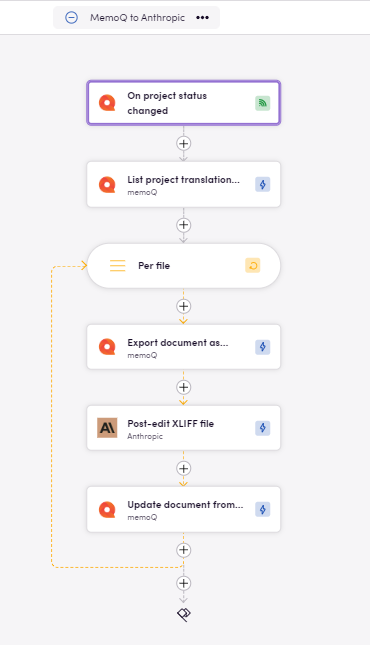

### Eggs: Starting Points for Your Birds

In Blackbird, Eggs are the seeds or blueprints for your workflows. They represent the initial ideas that have the potential to become fully-fledged Birds.

In this Egg-guide, let's explore some options to integrate a TMS and an LLM. [Find **Downloadable Eggs** at the end!](https://docs.blackbird.io/eggs/tms-to-llm/#download-an-egg)

## Process Outline

1. **Trigger: status in your TMS**
Files or Tasks or Projects reach a certain status in your TMS workflow
2. **File download**
Files are downloaded from the TMS.
3. **LLM**
The downloaded files are sent to an LLM for processing.
4. **Processed file upload**
Processed files are uploaded back to the TMS.

Egg between Phrase and Anthropic

## Tips

- **Prompt:** Within the optional inputs, you can add your own instructions for the LLM.
- **Bucket size:** XLIFF files can contain a lot of segments. Each action takes your segments and sends them to th LLM for processing. It’s possible that the amount of segments is so high that the prompt exceeds to model’s context window or that the model takes longer than Blackbird actions are allowed to take. This is why we have introduced the bucket size parameter. You can tweak the bucket size parameter to determine how many segments to send to the LLM at once. This will allow you to split the workload into different calls. The trade-off is that the same context prompt needs to be send along with each request (which increases the tokens used). From experiments we have found that a bucket size of 1500 is sufficient for models like gpt-4o. That’s why 1500 is the default bucket size, however other models may require different bucket sizes.
- **Polling Events:** Some apps use [polling](https://docs.blackbird.io/concepts/triggers/#polling) instead of webhooks to detect updated/new files. Check for an _Interval_ tab when setting up your trigger and choose the appropriate time for you (between 5 minutes and 7 days).
- **Glossary Integration:** Glossaries can be added to enhance translation accuracy and consistency. They can be exported from a number of apps, and Blackbird will ensure compatibility (apps include TMS & CAT tools, even [Microsoft Excel sheets](https://docs.blackbird.io/apps/microsoft-excel/#exporting-glossaries)).
- **Target language:** You can select a language from the inputs of the LLM app you are using. If none are provided, the languages will be extracted from the header of your XLIFF files.
- **Optional parameters:** Many LLM apps offer different parameters to be set, such as formality, temperature, models and bucket size. Check the input tab for all steps.
- **Loops are needed:** Whether to iterate through a list of target languages or to send each file within a group of downloaded files to an action that only takes one at a time, [loops](https://docs.blackbird.io/guides/loops/) are the key.

Egg beween MemoQ and Anthropic

Egg between MemoQ and OpenAI with glossaries.

## Suggested Apps

### LLMs

- [OpenAI](https://docs.blackbird.io/apps/openai/)
- [Anthropic](https://docs.blackbird.io/apps/anthropic/)
- [Google Vertex AI](https://docs.blackbird.io/apps/google-vertex-ai/)

Egg between Phrase and Anthropic

## Download an Egg

Download JSON workflows to import into your Nest, make any desired adjustments, and **fly**.

- <a href="https://docs.blackbird.io/downloads/MemoQ_to_OpenAI.json" download>MemoQ to OpenAI</a>
- <a href="https://docs.blackbird.io/downloads/MemoQ_to_OpenAI_with_Glossary.json" download>MemoQ to OpenAI with glossaries</a>
- <a href="https://docs.blackbird.io/downloads/MemoQ_to_Anthropic.json" download>MemoQ to Anthropic</a>
- <a href="https://docs.blackbird.io/downloads/Phrase_to_Anthropic.json" download>Phrase to Anthropic</a>

### Importing Eggs

To import an Egg into your Nest:

1. Navigate to the Bird Editor section.
2. Click on Import on the top right.
3. Select the Egg (JSON) file to import and click `Import`.
4. Identify the newly created Bird and click on it to edit it.
5. Update the Connction details and any other needed input/output parameters or desired steps. Look for red warning signs next to the step name signaling missing details in said step.
6. Click Save/Publish.

