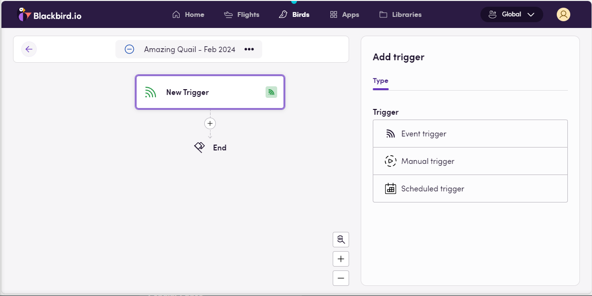
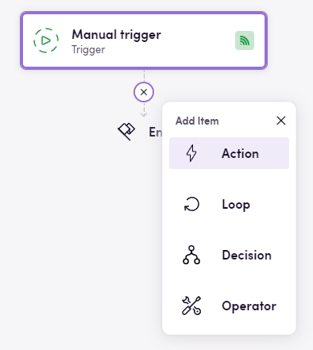
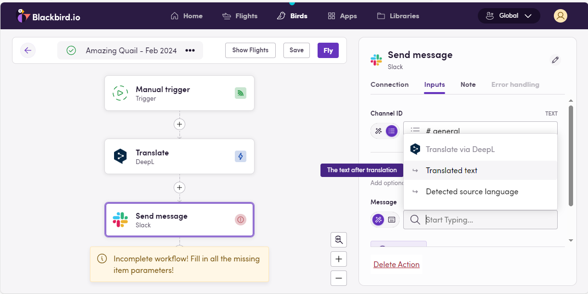
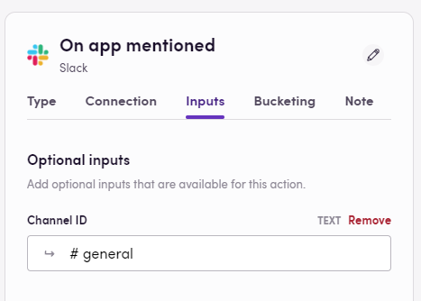
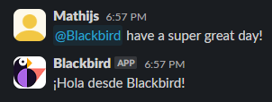
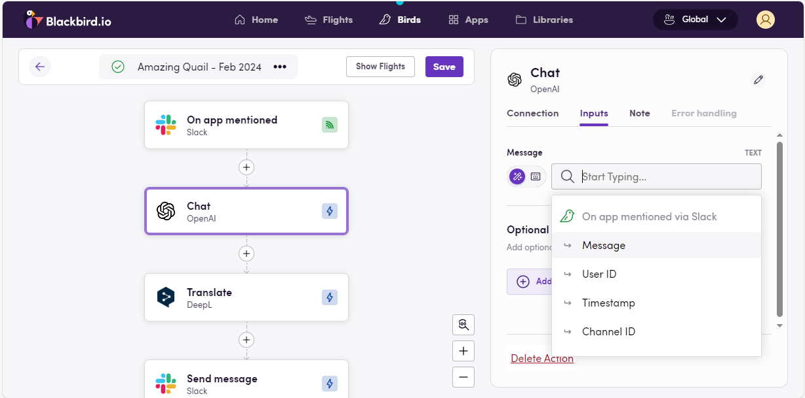
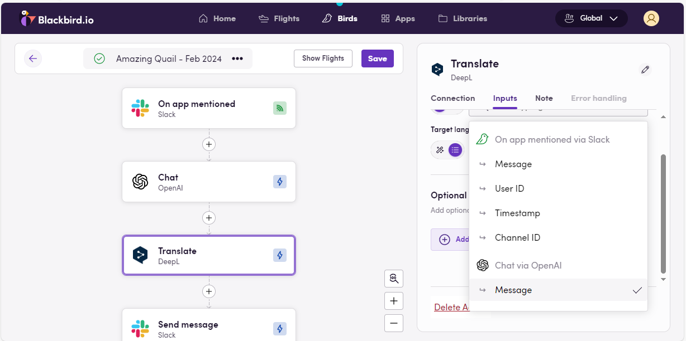
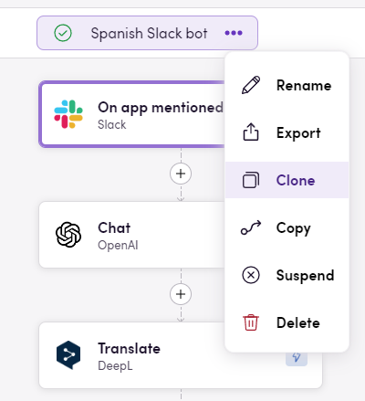

In order to become an expert bird watcher you have to start somewhere. This guide is for Blackbird beginners and will get you up to speed with the basics of building birds.

This guide is going to teach you the general approach to any workflow you may want to automate with Blackbird. We are going to do this step-by-step so you are encouraged to follow along with your own Blackbird account! We will be using the [Slack](/blackbird-docs/apps/slack), [DeepL](/blackbird-docs/apps/deepl) and [OpenAI](/blackbird-docs/apps/openai) apps. When prompted for connection credentials you can view how to connect in their respective documentation sections. Of course you can also use alternatives to these apps, e.g. [Amazon Translate](/blackbird-docs/apps/amazon-translate) instead of DeepL.

By the end of this guide, you will have built a Slack bot that responds to your messages in Slack in a different language. This is in our experience the most fun first bird you can build! Of course it is not really applicable to _real world_ scenarios (although elements of it can be). In later guides you will learn more about how to tackle production birds and how to set up localization-related workflows.

## Step 1: A bird that sends a message

Nagivate to the birds page and click on the big purple button **Create**. This opens the bird editor. You will be greeted by the following screen.

Let's go over the elements on the screen:

- The center of your screen shows you the trigger, and later all the actions that are executed. The **+** icon will allow you to create actions and other workflow related steps.
- The right side of the screen shows the details of your selected step. Right now the **New trigger** step is selected and so you are able to configure it.
- Above the workflow you can see the name of your bird and a button with 3 dots (**...**), this button is used to manage the meta data of the bird. From here you can rename, export, clone and copy the bird. It will also show you available updates of apps if there are any.

To build the simplest bird possible we are going to select **Manual trigger** on the right side of the screen. A manual trigger means that we can trigger this bird from inside Blackbird by clicking a button.

Now it's time to define our first action. We do this by clicking on the **+** icon in the center of the screen and selecting **Action**.

You will see a new action underneath your trigger. However, the action is still empty and we must define what to do with which app and which connection.
Go ahead and click on app on the right side of your screen. Search for the app that you want to add the action for. In our case this is _Slack_.

After defining the app, we now have to define the action we want to take. We are going to send a message in Slack so search for _Send message_ and select it.
Finally, we select the connection. You can click on **Add new connection** if you haven't created a Slack connection yet.

The final result should look like this:

Now that we knows what to do, we have to tell Blackbird what information to send. Click on the purple button **Continue**, or on the tab that says **Inputs**.

Your actions require extra information in order to execute. Some of this information is required, some of it is optional. We can see in the image below that the _Channel ID_ is a required parameter for the action: Blackbird wants to know to which channel the message should be sent.

When passing information to an action we need to be aware that this information can come from either of two places:

- If the information is coming from an action or event that happens _before_ this action, then you should select the magic wand icon in front of the information field. The magic wand signfies that Blackbird will use data that was the result of other actions or events during the execution of your workflow.
- If the information is _static_ and only defined while you are building the bird, then we use either the dropdown or text input.

> **💡 Note**: the difference between dropdown and text input is defined in the Blackbird app and based on whether the information that can be legally inputted is finite (in which case there is a dropdown) or infinite (in which case you can type the information yourself).

Let's define the _Channel ID_ that Blackbird wants from us. The channels that are possible values for this parameter are finite and pre-defined. Therefore, when you click on **Select input data** Blackbird will actually show you the channels that are available to you from the connection!

You can type in the search box in order to narrow down your search. Select a channel that you want to use for this bird, in our case we are going to simply select the _#general_ channel.

We have defined what channel to send the message to, great! Now we also have to tell Blackbird what message to send. Click on **Add input** to see a dropdown of all possible optional inputs. Select **Message**. Now type in a message that you want to send. In our case we are going to send _Hello from Blackbird!_ You can type any message you want (indicated by the keyboard icon).

> **💡 Note**: In Slack it's not possible to send a message without an actual message text or an attachment. The reason the message is still optional is because you could also send an attachment without an accompanying text.

Your action should now look something like this:

That's it! Now it's time to fly your first bird. You do this by clicking on the purple **Fly** button on the top of the screen.

You should almost instantly see the message in your Slack channel!

It is now possible to also verify the execution of this bird in BLackbird. We do this by clicking on **Show Flights** next to the fly button. You will see a list of flights. When clicking on a flight you can inspect every event and action that has executed. By clicking on an action you can also see the input and output values that were passed through.

## Step 2: Sending a translation

Let's add a second step to the bird. We want to first translate a sentence using DeepL, and then send the translation to our Slack channel. In order to do this, we need to add a new action. This action should happen _before_ we send the message to Slack. That's why we are creating a new action in between the trigger and **Send message**. Click on the **+** icon and select action again.

This time we are not selecting Slack as our app but DeepL. Then select the action **Translate** and your connection (create one if you don't have any yet). Your screen should then look like this:

It's time to fill in the information again by clicking on **Continue**. This time two fields are required: _Text_ and _Target language_. We are free to type in any text we want, we also see that _Target language_ will present us with a dropdown. Fill in a text to translate and select a target language, in this case we are going for _Hello from Blackbird!_ and _Spanish_.

> **💡 Note**: When inspecting the optional values we see that DeepL can take in a lot more information, feel free to explore these options!

We're almost ready to fly. Almost, because now comes the most important part! We can expect that DeepL will send us a translation back, we now need to tell Blackbird to take that translation and send it in our Slack message.

We do this by going back to our Send message action by clicking on it. You see that the message we are sending is still the message we previously typed in. Remember that magic wand icon? Let's use it now!

Click on the magic wand in front of the _Message_ field. The input field now changes to a dropdown. Click on the dropdown and you are presented with the information that is returned from DeepL.

You may notice that Blackbird is also warning you that your workflow is incomplete. Let's quickly click on **Translated text** as that is the information we want to send from DeepL to Slack. After you have done this, everything should look fine and it is time to click on the **Fly** button again!

🥳 ¡Felicidades! You have just created a bird that demonstrates the most important aspect of Blackbird: taking information from one application and passing it onto another one. Feel free to click on _Show Flights_ again to see all the information about the flight. After having done that, are you ready to take it to the next level?

## Step 3: Responding to a message

So far we have triggered this bird by clicking on the **Fly** button. Wouldn't it be a lot more fun if this bird actually triggers on messages that are sent in Slack?
It's time to change this manual trigger. What we want to achieve is that if someone sends a message to a channel while tagging _@Blackbird_, this bird will fly and translate the message for you.

Let's start by clicking on the **Manual trigger**. On the right side we can now change it to an **Event trigger**. Event trigger always means that we are triggering based on things happening in connected applications.

Unlike the manual trigger, the event trigger does require some configuration. After you click on **Continue** you'll be presented with a familiar menu. It's time to select the app, event and connection. For app select Slack and for the event select **On app mentioned**

> **⚠️ Warning**: you may be inclined to use the **on message** event. This would be a mistake though, as during this bird we are also going to send a message back to Slack, which would in turn trigger the bird again. That's an infinite loop! You will find that being aware of scenarios like this is going to be the actual difficult part of _Solution architecting_.

If we would publish the bird like this, Blackbird would respond to any message with it being tagged _in any channel_. If you only want Blackbird to listen to a specific channel, then click on **Inputs** and select a channel for **Channel ID**.

Now that we have changed the trigger to an event, we don't see the **Fly** button anymore. Instead we see **Save** and after clicking on **Save** we see **Publish**.

Go ahead and click on **Publish**. Behind the scenes Blackbird is now contacting Slack and telling it to notify it whenever a user is sending a message that mentions it is sent.

Let's see it in action! Go to your channel and send a message tagging _@Blackbird_.

> **💡 Note** you may have read in the Slack documentation that for in order for events to work, the Slack app needs to be added to a channel. You can do this through the Slack channel menu, or by sending a message with _@Blackbird_, Slack will then prompt you if you want to add the app to that channel. Agree.

Oops! You see that we have changed the bird to trigger whenever we are sending a message that includes _@Blackbird_. However, it is not doing what we want yet. We want to translate our message, not get the same translation of our static text of course!

Let's quickly fix this by going into the **Translate** action. It's time to use that magic wand again! Instead of the keyboard input for **Text** we are going to want to select our message that came in to our event. Click on the magic wand and then select **Message** from the dropdown.

Remember: we are passing information (our message) from the event to DeepL. Then we are passing the information (our translated message) from DeepL to Slack again.

> **💡 Note** as you can see, Slack is giving us more information than just the message. We could f.e. use Channel ID in our third action in order to always send the message back to the channel where the event was triggered in.

Click **Save** and **Publish**. It's time to try again and see if our bird works now!

🎉 ¡Súper genial! you just created a bird that responds to your messages on Slack and translates them into Spanish! Now this is already a pleasure to play with, but can we turn the fun up to 11 by introducing OpenAI?

## Step 4: turning it into a chat bot

It's time to add our last app: OpenAI. Instead of translating our message into Spanish, we want to actually chat with ChatGPT and have the result sent back to us in Spanish. Because we want to translate the message from the event before translating it, we add a new action in between **On app mentioned** and **Translate**.

For your action, select **OpenAI** and **Chat**. Click **Continue** and select the message we want to send to OpenAI. Of course, this is the message we just received from Slack.

Let's also not repeat the same mistake we made during step 3: we now also need to update the next action to take the right information. Click on **Translate** and then on the parameter for **Text**. Instead of the message that came in from the event we now select the message that we get back from OpenAI.

You may realize by now, that configuring Blackbird birds is really an exercise of _connect the dots_.

That's it! It's time to **Save** and **Publish** again.

It's time for the moment we have all been waiting for. Let's ask Blackbird a question on Slack and see what happens.

🙌 ¡increíble! We just created a Spanish slack bot in just a few steps. Congratulations! If you are curious what the English message was, then click on **Show Flights**, select the most recent flight and click on **Chat** under **Outputs** you can see exactly what OpenAI returned.

If at any point you want to pause Blackbird from listening to your channel, but not delete bird, you can click on the three dots menu and select **suspend**. Turning it back on can be done with the **live** button.

To really wrap up this bird you can give it a nice name by opening the three dots menu on the top and clicking **Rename**

## Next steps

Before following any of the more advanced tutorials we encourage you to play around with this bird and make some small changes. For example: create a bird that responds to a message whenever a certain emoji is added as a reaction, or create a bird that takes the file attachments of a message and translates these.

Our final bonus tip is to use the clone functionality in the top menu. By cloning a bird you can very quickly make some changes and test them while maintaining your original bird.

Good luck and have fun!
