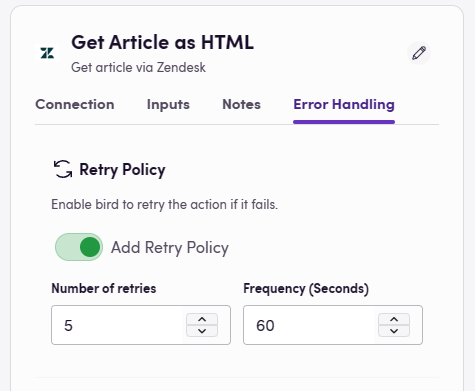
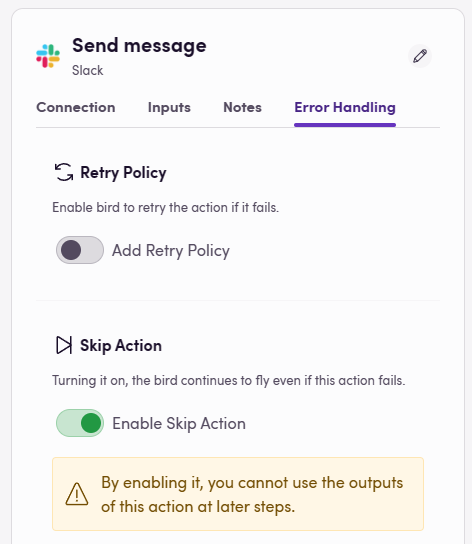

Effective error handling can be a crucial component of any workflow orchestrator. Blackbird offers several ways to manage errors when they occur. This guide will walk you through the three main aspects of error handling in Blackbird: Setting a retry policy, allowing users to skip actions if an error occurs, and flying a bird when any bird errors (a feature currently not yet available).

## Retry policy

How a workflow deals with errors can have a big impact on its overall performance. Retrying actions that failed due to temporary problems can often help complete a workflow that might otherwise be stuck.

To set up a retry policy in Blackbird:

1. From an action, navigate to the '_Error handling_' tab.
2. Define the maximum number of retries in the '_Number of retries_' field.
3. Specify the retry interval in the '_Frequency (Seconds)_' field.

The bird will now attempt to re-execute the action the designated number of times at the specified interval if it encounters an error.

### When to use a retry policy

One may think that it's wise to apply a retry policy to every action in their bird "just in case". This is unfortunatly not the case because of the following reasons:

- A retry policy may incur extra API usage cost.
- A well-built app should already take care of retries under the hood for common scenarios such as rate limits.
- Retrying an action with side-effects can cause logical issues in the systems you connect to. For example, if the action creates a new project in a system then multiple projects can suddenly be created because the underlying error occured after the project creation was handled. In technical terms one needs to take _idempotency_ into account.

This still leaves us with the question when you should be using the retry policy feature. As a general rule of thumb it is recommended to add a retry policy when the system you are connecting to can be assumed to be unstable in certain scenarios and from testing your bird you conclude that adding a retry policy would make your work of operating this bird less cumbersome.

So adding a retry policy to an action that sometimes fails due to a server being overloaded, while the action itself does not spawn new entities in this system is good practise. Adding a retry policy to an action that can fail because a user misconfigured a certain value is not recommended as retrying the action will never yield good results and it is in this case often better to be notified sooner rather than later.

## Skipping an action on error

There may be cases where an error can occur, and you'd like the workflow to progress regardless of the error. In these situations, you can skip the failed action and continue with the rest of your workflow.

To enable this:

1. Find the desired action in your workflow, then go to the '_Error Handling_' tab.
2. Toggle '_Enable Skip Action_' on.

Now, if this particular action errors, it will be skipped, allowing the workflow to proceed.

> **💡 Note**: When you are enabling the skip action ability, the output values of this action cannot be used anywhere else in the bird.

### When to skip an action on error

The skip action ability is designed to work perfectly for non-essential workflow steps. E.g. steps that are not vital for the correct executing of your workflow like logging, notifications, status updates, etc. It is up to the user to decide which actions are non-critical and are permissable to be skipped.

## Error handling (not released yet)

This feature will allow you to trigger birds when other birds fail. You can use this to notify yourself or others of failed flights, create tickets or even rollback changes. It is expected to be released in Q2 2024.

## End Notes

Dealing with errors is a key aspect of any workflow design. At Blackbird, we're dedicated to providing you with the tools you need to manage your workflows efficiently, even when things go wrong. Keep an eye on this guide for future updates as we continue to improve our platform. As always, if you need help or have questions, please reach out to the support team.
