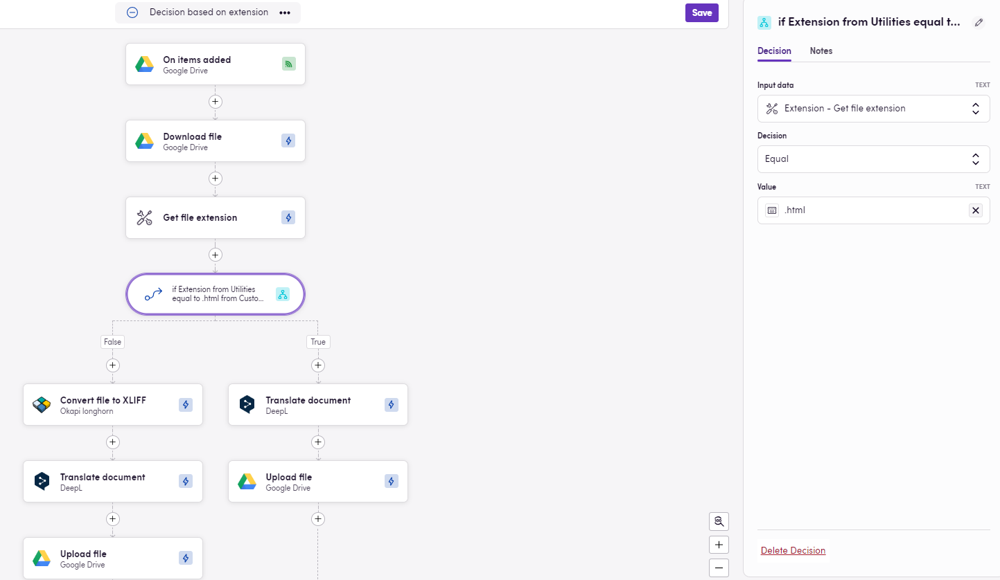
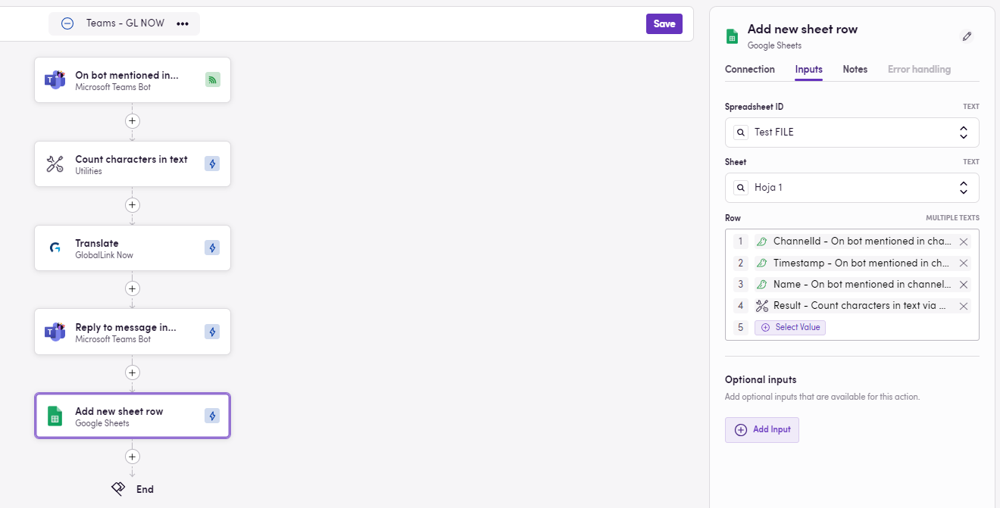
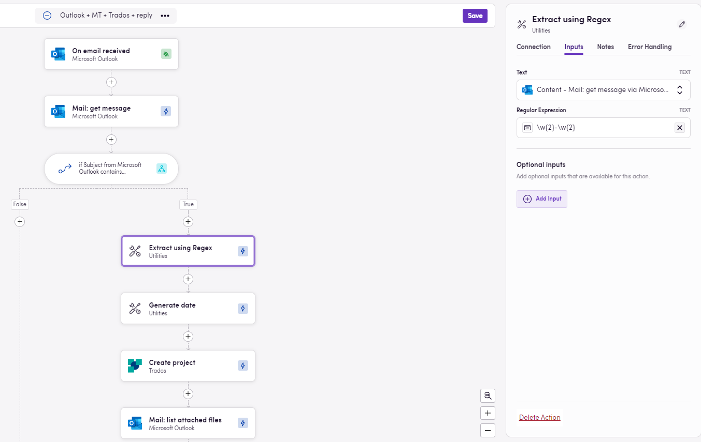
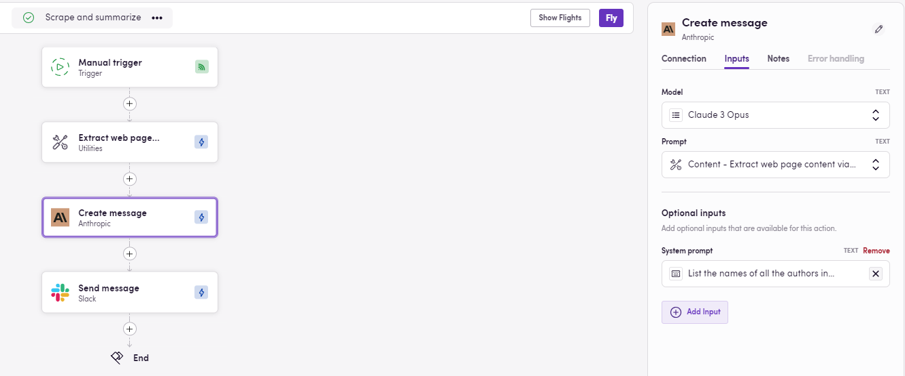
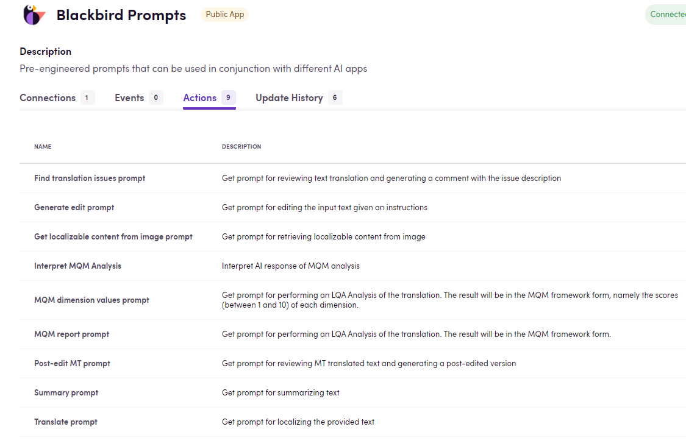
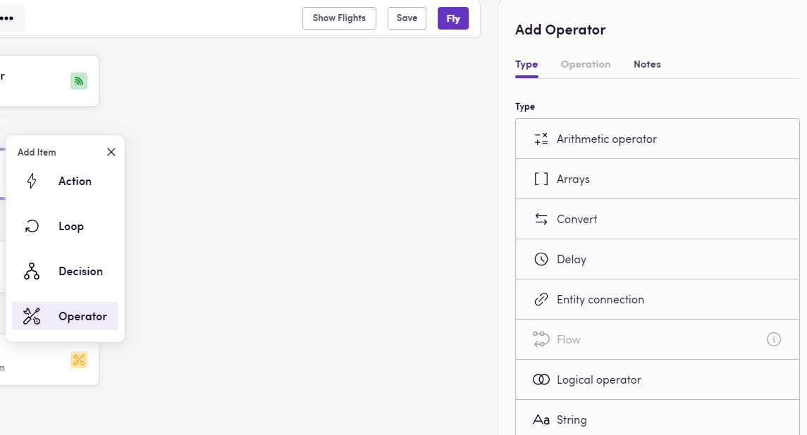
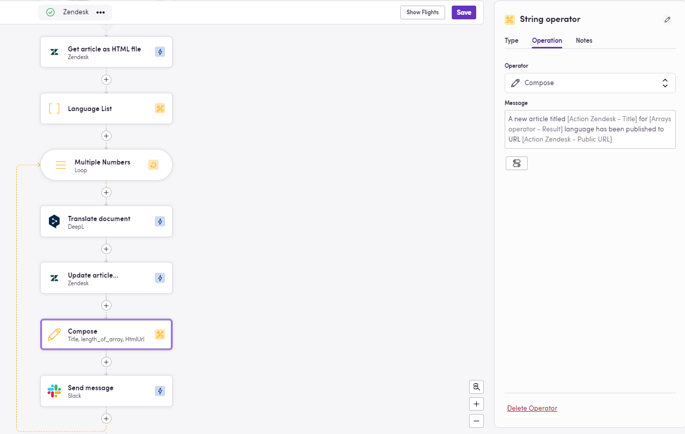

When navigating across apps in a workflow, you may find yourself needing to perform some extra actions to twist and transform data in multiple ways. Here are some Blackbird tools that will help you succeed.

## Utilities app

The [Utilities](https://docs.blackbird.io/apps/utilities/) app provides a wide range of actions to help you manage your data. Here are some examples:

- Dates: 
    - You can generate a date (e.g. today) and add/subtract days to it (considering or not business days). This can be very convient for setting up deadlines or creating dynamic dates for querying data. You can also format your date in various ways.
- Files: 
    - You can extract the name of a file and even change it - you may want to append the language name you are translating the file into to the name of the file. 
    - You can also get the extension of a file, which would be very useful in case you need to route files of different types into different paths. 
    
    - You can count the number of words or characters in a file. Maybe you need to keep track of how many characters are sent to your MT engine because you are charged based on this, then it becomes a valuable piece of data to extract and record. 
- Text:
    - It is also possible to count words and characters from text formats. So, if you pick up a message from Slack or Teams, or you want to know how long a file name is, you can use the actions in Utilities to count any of these.
    
    - Regular expressions can be used to extract or replace content from text. While extracting content, you can specify as optional parameter the group number you want to extract specifically. Or you can use grouping with the replace action to regroup parts of your text. With these options you can extract email addresses from a message or a list of language codes from an email body. 
    
- Range of numbers:
    - Providing a start and end point, a range of numbers can be generated. This is particularly useful when paired with a Loop because you need to repeat an action an X number of times. A good use case is iterating through the rows of a table (think of Microsoft Excel) and getting information from column A, processing it and finally pasting the result to column B. In this scenario, you can use the numbers in the range to indicate the row number.
    
- Arrays:
    - There are also a couple of useful option to work with arrays or groups of items. Using the "Array Contains" action you can check whether one value is included in the array or not, and make decisions based on that. For instance, one of your clients does not exist in your list of contacts, therefore you can add them without creating duplicates. 
    - Speaking of duplicates, there is also an action to return a list of unique values given an array as input. 
- Scraping:
    - Raw and unformatted web page content can be extracted from a URL. You can also provide an XPATH to specify the exact content to be scrapped. This is particularly useful if you need to take content from a webpage but don't have access to the CMS or source code.
    

## Document Loader app

This app comprises some very useful options when working with files.

- XML files:
    - If you are working with XML files, you may need to get the value from a specific property, or change it, or even update the version property. These are all possible. 
- Text files:
    - If your file is docx/doc, pdf or txt format, the file can then be opened and content extracted. Especially useful if you want to send this content to an AI model that does not take files. 
- Text:
    - Text can be converted into a .txt file or even chunked into smaller pieces. So if you get text as output from app A and app B (probably a TMS) only takes files, the "Convert text to txt document" will help smooth this transition. On the other hand, if your text is too long, you can chop it into smaller pieces. 

## Blackbird Prompts app

This app contains a collection of pre-engineered prompts that can be used in conjunction with different AI apps. These prompts have proved to be successful when working with language actions. The list comprises prompts for getting translation issues, summarizing text, getting translation reports, performing post editing, and more. 

## HTTP app

This application allows you to perform basic HTTP requests (GET/POST/PUT/PATCH/DELETE) to a certain endpoint and even download files. 

## String operators

When adding an action via plus sign, you can also choose to add an Operator instead. The string operator is very handy and popular as it allows very interesting options.

- String Compose: This option allows the user to compose a message, whether by typing or using outputs from previous actions or both multiple times. This super powerful tool allows you to create a message stating, for example, that the article + _the name of the article_ + has been published to + _the URL value_ + in + _language it has been translated to_.

- String Split: Given a string of text, maybe a list of items in text format. You can specify the separator and get in return an actual list that you can loop through and treat each of these items separately. 

Finally, if you need to twist these _apps_ in any way (maybe add your own recurring prompt to Blackbird Prompts, or change the HTTP app to add authentication or specific parameters), you can clone the code from Github, where our [open source code resides](https://github.com/orgs/bb-io/repositories), make the necessary changes and redeploy your customized app to Blackbird (Apps > Custom apps > Create app). Find more details [here](https://docs.blackbird.io/sdk/deploying/#uploading). These custom apps will only be available to the nest(s) you choose to upload it to. 

Now that you've made it through this guide and with these options at your fingertips, the sky's the limit. So, spread your wings, explore, and let your creativity soar. Should you need guidance or find a feature missing, don't hesitate to contact us. Happy Flights!

