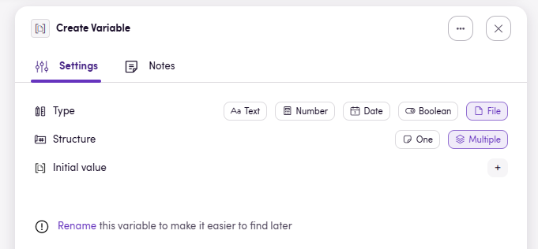
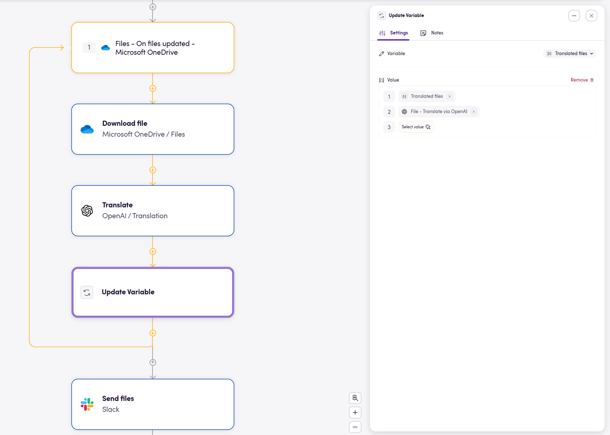
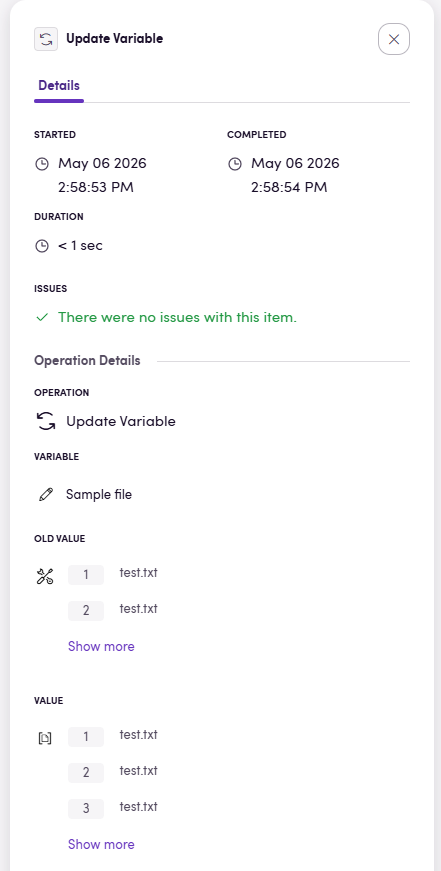

Variables let your Bird store a value and reuse it later. This is useful when you want to keep track of information across multiple steps, build up a result over time, or replace a value partway through the flow.

In Blackbird, variables are added from the `Variables` section in the add item modal. There you will find two operators:

- `Create Variable` to define a new variable.
- `Update Variable` to replace the current value of an existing variable.

Both operators can also be found from the top-level search in the add item modal by searching for terms like `variable`.

## When to use variables

Variables are useful when you need to:

- Keep a value available for multiple later steps.
- Rename an intermediate result so it is easier to recognize in dropdowns.
- Build a string over multiple steps.
- Collect values, like files, into an array during a loop.
- Store a value that may change after decisions or intermediate actions.

If you only need a value once, using a direct action output is often enough. Variables become most useful when the same value needs to be reused or updated later.

## Creating a variable

Add a `Create Variable` item when you want to introduce a value into the flow. Every variable has two required settings:

`Type` and `Structure`. The type can be `Text`, `Number`, `Date`, `Boolean`, or `File`. The structure can be `One` or `Multiple`. After choosing the type and structure, you can optionally set an initial value.

### Rename variables early

When a variable still has the default name `Create variable`, Blackbird shows a hint below the conditions encouraging you to rename it. This is worth doing immediately, because the variable name is what you will later recognize in dropdowns and input selectors.

## Updating a variable

Add an `Update Variable` item when you want to replace the current value of an existing variable.

When first added, the operator has one required input: `Variable`.

Clicking the `+` opens a dropdown with all variables that were created earlier in the Bird. Only variables above the current `Update Variable` step are available. Once you choose a variable, a second required input appears: `Value`. The type of the `Value` input always matches the selected variable. 

`Update Variable` does not produce an output of its own. Instead, it changes the current state of the selected variable for all later steps in the flow.

### How updates behave

Updating a variable always replaces the current value with the new one.

For example:

1. Create a text variable called `Greeting` with the value `Hello`.
2. Update `Greeting` to `World`.
3. Any later step that uses `Greeting` receives `World`.

You can also use the current variable value as part of the new value:

- For text, this makes string concatenation easy. Start with `Hello`, then update the variable using the magic wand and add ` World`.
- For arrays, you can include the existing array as one array entry and add more values after it. Blackbird flattens the array, which makes this a practical way to append items during a loop.

## Variables inside loops

As seen in the example above, variables work well with loops, especially when you want to collect results over time.

A common pattern is:

1. Create a `Multiple` variable with no initial value.
2. Enter a loop.
3. On each iteration, update the variable by combining the current variable value with the new item from that iteration.
4. Use the finished array after the loop.

This is useful for cases such as gathering downloaded files and sending them together in one later action.

One important detail: if a loop is iterating over an array, updating that same array during the loop does not change the loop itself. The loop keeps using the array structure that existed when the loop started.

## Variables on the Flight page

When inspecting your Flights, you will find that the `Update Variable` operator gives you a lot of information about what's happening. Namely, which variable was changed, what the old value was and what the new value is.

Remember that the icon in front of the variable will always indicate what the type is. `Text`, `Number`, `Date`, `Boolean`, or `File`.

## Practical examples

Here are a few common use cases for variables:

- Keep a boolean flag that is changed after a decision.
- Build a final message step by step using text updates.
- Collect files during a loop and send them together after the loop ends.

Variables are best thought of as reusable working memory for your Bird. If a value needs to change over time, it is probably a good candidate for a variable.
