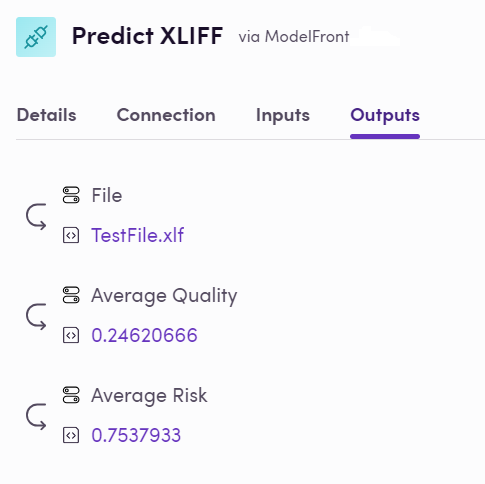
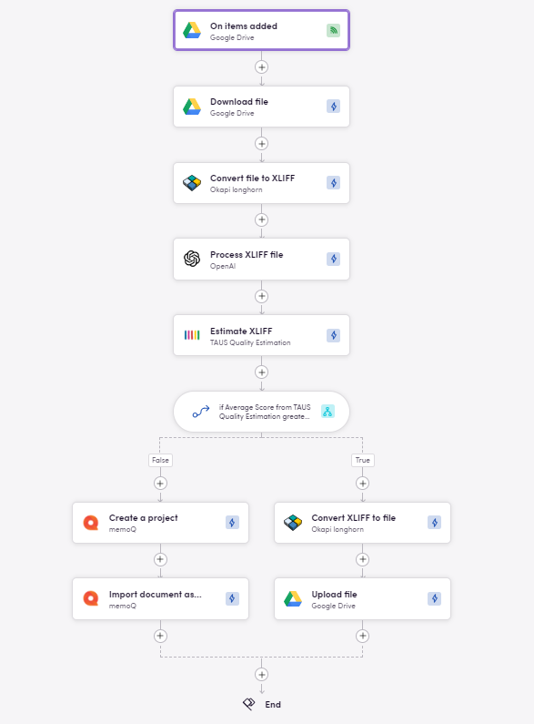

XLIFF (XML Localization Interchange File Format) is the beacon of standardization in the language and localization industry, allowing for the seamless exchange of translation data. It organizes content into translation units, each comprising a source segment and its corresponding target translation.

While most Translation Management Systems (TMS) and Computer-Assisted Translation (CAT) tools effortlessly handle XLIFF files, some other tools may not be as file-friendly. However, in the realm of Blackbird, where interoperability reigns supreme, we've unfurled new wings—er, actions—to make XLIFFs soar even in non-file-friendly apps.

### What's Hatched?

In our latest release, we've introduced new actions that allow XLIFF files to gracefully dance through apps like OpenAI, DeepL, TAUS, and ModelFront, which typically prefer text over files.

### Why Choose XLIFF?

Why not? It's the universal language of localization! Plus, with our newly integrated app, Okapi, converting between various file formats and XLIFF has never been smoother. This means your flock of apps can now join forces in a harmonious flight, expanding the horizons of what's possible with Blackbird.

## Apps

### Okapi

With the [Okapi](https://docs.blackbird.io/apps/okapi/) Framework on board, converting files to and from XLIFF is a breeze. Our two new actions, "Convert file to XLIFF" and its trusty counterpart "Convert XLIFF to file," pave the way for seamless file format transformations. Check out the supported file types for these actions [here](https://www.okapiframework.org/wiki/index.php?title=Filters) and let your files spread their wings.

### OpenAI

Introducing the "Process XLIFF file" action! While it may seem like magic, behind the scenes, Blackbird diligently dissects each translation unit within your XLIFF, processing source-target pairs accordingly via [OpenAI](https://docs.blackbird.io/apps/openai/). Instructions are provided as `Prompt` input but, if none are specified, then by default the source text will be translated and targets updated, resulting in a localized XLIFF.

## Quality Estimate Apps ([TAUS](https://docs.blackbird.io/apps/taus/) & [ModelFront](https://docs.blackbird.io/apps/modelfront/))

Our newest Blackbird actions allow for a bird's-eye view of your XLIFF's quality. By calculating the quality score of each segment within the XLIFF and returning an aggregated number that gives us an idea of the overall quality in the file. This was previously reserved for single segments only. Additionally, all translation units get appeneded with their individual score which is added to the extradata attribute in the XLIFF file.

Optionally, Threshold, New Target State and Condition input parameters can be set to the Blackbird action to change the target state value of segments meeting the desired criteria. This means that you can signal properly translated segments and block them when importing the XLIFF file into a TMS for human revision, saving time and money and focusing efforts in those segments that actually need editing.

Example
Setting the optional input values as shown in the image below will result in all segments with a score above 0.9 to have their target state values updated to “final”. When importing these XLIFF files into TMS tools, a setting can be usually added to lock segments with a specific target value ("final" in this case), so that translators can focus on and edit only the segments of lower quality.

## Behold, a majestic bird in action!

While the new actions on its own add great value and enable new possibilities, when chained, they become even more powerful. Below is an example bird that takes a .docx file as input, the file is then converted into XLIFF for interoperability purposes, OpenAI is then used to translate the file into the target language. After this, TAUS is used to determine the quality of said translations and a decision operator is used to define the next steps for the file: if the average quality score is above the defined 0.95 threshold, the XLIFF is then converted into a translated .docx and delivered as final. Otherwise, if the average score is below 0.95, the file is imported into a TMS for further human editing. This ensures that only files that actually need a human in the loop are uploaded into the TMS, while quality translations are immediately delivered back.

