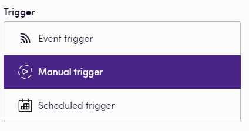
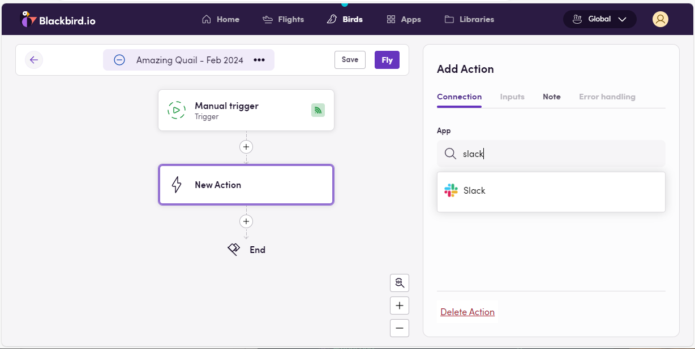
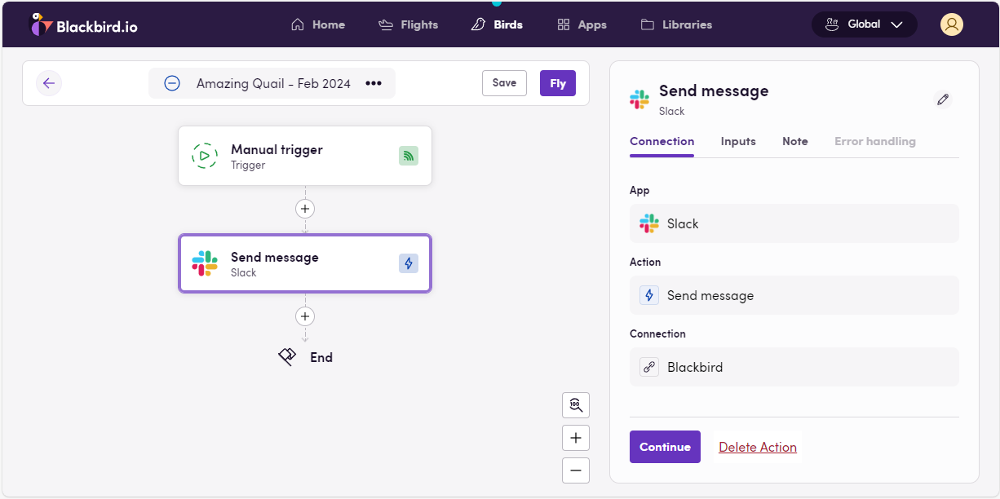
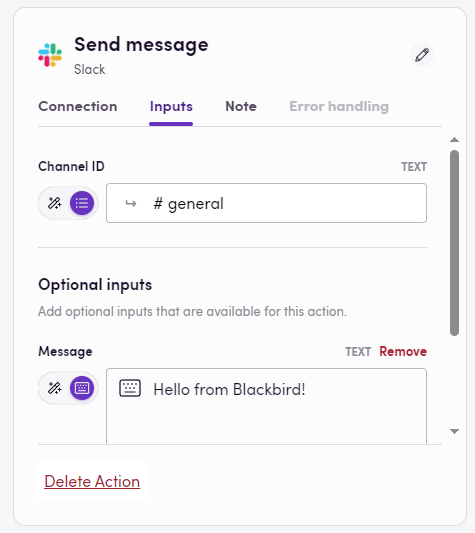
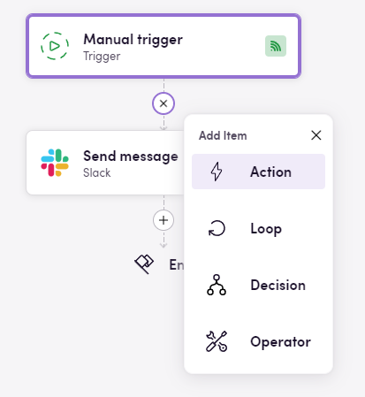
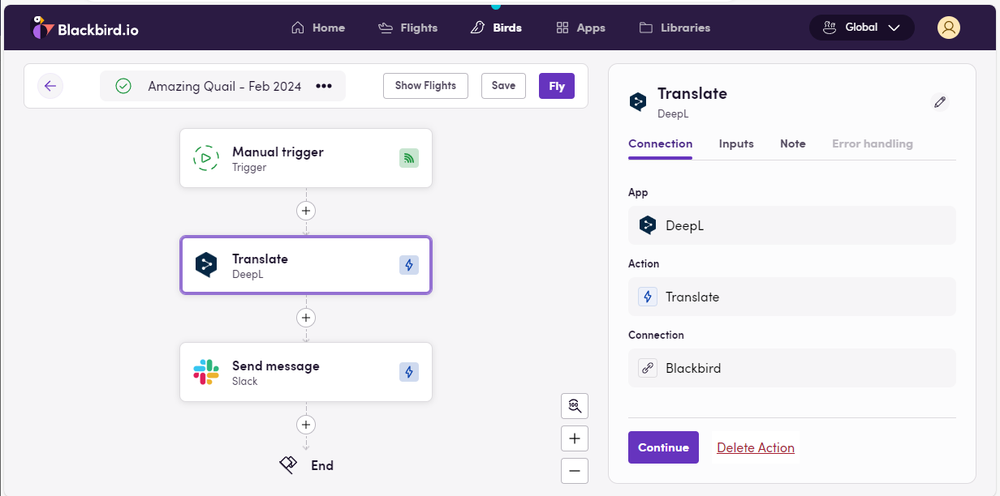
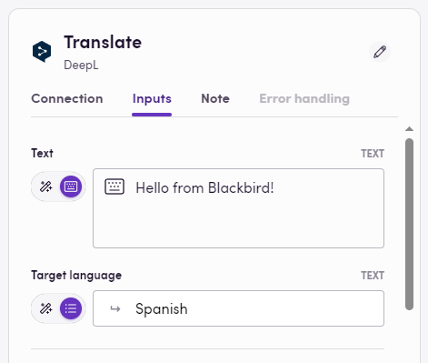
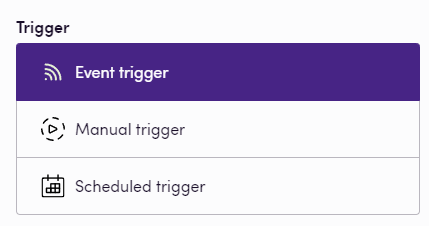

Ahhoz, hogy szakértő madarász legyél, valahol el kell kezdened. Ez az útmutató a Blackbird kezdőknek szól, és megismertet a bird-ök építésének alapjaival.

Ez az útmutató megtanítja neked az általános megközelítést bármilyen munkafolyamathoz, amit a Blackbirddel szeretnél automatizálni. Lépésről lépésre haladunk, ezért javasoljuk, hogy kövesd a saját Blackbird fiókoddal! A [Slack](/blackbird-docs/apps/slack), a [DeepL](/blackbird-docs/apps/deepl) és az [OpenAI](/blackbird-docs/apps/openai) alkalmazásokat fogjuk használni. Amikor a kapcsolódási adatokat kéri, megtekintheted a csatlakozás módját a megfelelő dokumentációs szakaszokban. Természetesen használhatsz alternatívákat is, például a [Amazon Translate](/blackbird-docs/apps/amazon-translate) szolgáltatást a DeepL helyett.

Ennek az útmutatónak a végére egy olyan Slack botot fogsz létrehozni, amely a Slackben küldött üzeneteidre más nyelven válaszol. Tapasztalataink szerint ez a legszórakoztatóbb első bird, amit építhetsz! Természetesen ez nem igazán alkalmazható a _valós világ_ forgatókönyveire (bár egyes elemei igen). Későbbi útmutatókban többet tanulhatsz arról, hogyan kezeld a gyártási birdeket és hogyan állíts be lokalizációval kapcsolatos munkafolyamatokat.

## 1. lépés: Egy bird, amely üzenetet küld

Navigálj a birds oldalra, és kattints a nagy lila **Create** gombra. Ez megnyitja a bird szerkesztőt. A következő képernyő fogad majd.

Nézzük át a képernyőn található elemeket:

- A képernyő közepén láthatod az eseményindítót, és később az összes végrehajtandó műveletet. A **+** ikon lehetővé teszi a műveletek és egyéb munkafolyamattal kapcsolatos lépések létrehozását.
- A képernyő jobb oldala a kiválasztott lépés részleteit mutatja. Most a **New trigger** lépés van kiválasztva, így azt tudod konfigurálni.
- A munkafolyamat felett láthatod a bird nevét és egy 3 pontos (**...**) gombot, ezt a gombot a bird metaadatainak kezelésére használjuk. Innen átnevezheted, exportálhatod, klónozhatod és másolhatod a birdet. Azt is megmutatja, ha alkalmazásfrissítések állnak rendelkezésre.

A lehető legegyszerűbb bird felépítéséhez a képernyő jobb oldalán a **Manual trigger** opciót fogjuk kiválasztani. A kézi indítás azt jelenti, hogy ezt a birdet a Blackbirden belül egy gombra kattintva indíthatjuk el.

Most itt az ideje, hogy meghatározzuk az első műveletünket. Ezt a képernyő közepén található **+** ikonra kattintva és az **Action** kiválasztásával tesszük.

Egy új műveletet fogsz látni az eseményindító alatt. Azonban a művelet még üres, és meg kell határoznunk, hogy mit kell tenni, melyik alkalmazással és melyik kapcsolattal.
Kattints az alkalmazásra a képernyő jobb oldalán. Keress rá arra az alkalmazásra, amelyhez a műveletet hozzá szeretnéd adni. Esetünkben ez a _Slack_.

Az alkalmazás meghatározása után most meg kell határoznunk, milyen műveletet szeretnénk végrehajtani. Üzenetet fogunk küldeni a Slackben, ezért keress rá a _Send message_ műveletre és válaszd ki.
Végül kiválasztjuk a kapcsolatot. Kattinthatsz az **Add new connection** gombra, ha még nem hoztál létre Slack kapcsolatot.

A végeredménynek így kell kinéznie:

Most, hogy tudjuk, mit kell tennünk, meg kell mondanunk a Blackbirdnek, hogy milyen információt küldjön. Kattints a lila **Continue** gombra, vagy az **Inputs** fülre.

A műveleteid végrehajtásához további információkra van szükség. Ezek közül néhány kötelező, néhány opcionális. Az alábbi képen láthatjuk, hogy a _Channel ID_ a művelet kötelező paramétere: a Blackbird tudni szeretné, melyik csatornára kell küldeni az üzenetet.

Amikor információt adunk át egy műveletnek, figyelembe kell vennünk, hogy ez az információ két helyről származhat:

- Ha az információ egy olyan műveletből vagy eseményből származik, amely a művelet _előtt_ történik, akkor az információs mező előtti varázspálca ikont kell kiválasztanod. A varázspálca azt jelzi, hogy a Blackbird olyan adatokat fog használni, amelyek a munkafolyamat végrehajtása során más műveletek vagy események eredményeként születtek.
- Ha az információ _statikus_ és csak a bird építése közben van meghatározva, akkor a legördülő menüt vagy a szövegbeviteli mezőt használjuk.

> **💡 Megjegyzés**: a legördülő menü és a szövegbeviteli mező közötti különbséget a Blackbird alkalmazás határozza meg, és azon alapul, hogy a jogilag bevihető információ véges-e (ebben az esetben van legördülő menü) vagy végtelen (ebben az esetben magad írhatod be az információt).

Határozzuk meg a _Channel ID_-t, amit a Blackbird kér tőlünk. A paraméter lehetséges értékeként megadható csatornák végesek és előre meghatározottak. Ezért, amikor a **Select input data** gombra kattintasz, a Blackbird valójában megmutatja a kapcsolatodban elérhető csatornákat!

Beírhatsz a keresőmezőbe a keresés szűkítéséhez. Válaszd ki azt a csatornát, amelyet ehhez a birdhez szeretnél használni, a mi esetünkben egyszerűen a _#general_ csatornát választjuk.

Meghatároztuk, hogy melyik csatornára küldünk üzenetet, nagyszerű! Most azt is meg kell mondanunk a Blackbirdnek, hogy milyen üzenetet küldjön. Kattints az **Add input** gombra, hogy megtekintsd az összes lehetséges opcionális bemenet legördülő listáját. Válaszd ki a **Message** opciót. Most írd be az üzenetet, amelyet küldeni szeretnél. A mi esetünkben a _Hello from Blackbird!_ üzenetet fogjuk küldeni. Bármilyen üzenetet beírhatsz (ezt a billentyűzet ikon jelzi).

> **💡 Megjegyzés**: A Slackben nem lehetséges üzenetet küldeni tényleges üzenetszöveg vagy csatolmány nélkül. Az üzenet azért még opcionális, mert csatolmányt is küldhetnél kísérőszöveg nélkül.

A műveletednek most valahogy így kell kinéznie:

Ennyi az egész! Itt az ideje, hogy elindítsd az első birdedet. Ezt a képernyő tetején található lila **Fly** gombra kattintva teheted meg.

Szinte azonnal láthatod az üzenetet a Slack csatornádon!

Most már lehetőséged van a bird végrehajtásának ellenőrzésére is a Blackbirdben. Ezt a repülés gomb melletti **Show Flights** gombra kattintva teheted meg. Megjelenik a repülések listája. Egy repülésre kattintva megtekintheted minden esemény és művelet végrehajtását. Egy műveletre kattintva láthatod az átadott bemeneti és kimeneti értékeket is.

## 2. lépés: Fordítás küldése

Adjunk egy második lépést a birdünkhöz. Először szeretnénk lefordítani egy mondatot a DeepL segítségével, majd elküldeni a fordítást a Slack csatornánkra. Ehhez egy új műveletet kell hozzáadnunk. Ennek a műveletnek az eseményindító és a **Send message** _előtt_ kell történnie. Ezért egy új műveletet hozunk létre az eseményindító és a **Send message** között. Kattints a **+** ikonra és válaszd újra a műveletet.

Ezúttal nem a Slacket választjuk alkalmazásként, hanem a DeepL-t. Ezután válaszd ki a **Translate** műveletet és a kapcsolatodat (hozz létre egyet, ha még nincs). A képernyőnek így kell kinéznie:

Itt az ideje, hogy újra kitöltsük az információkat a **Continue** gombra kattintva. Ezúttal két mező kötelező: a _Text_ és a _Target language_. Szabadon beírhatunk bármilyen szöveget, amelyet le szeretnénk fordítani, és látjuk, hogy a _Target language_ egy legördülő menüt mutat nekünk. Tölts ki egy lefordítandó szöveget és válassz egy célnyelvet, ebben az esetben a _Hello from Blackbird!_ és a _Spanish_ (spanyol) opciókat választjuk.

> **💡 Megjegyzés**: Az opcionális értékek vizsgálatakor láthatjuk, hogy a DeepL sokkal több információt is elfogadhat, nyugodtan fedezd fel ezeket a lehetőségeket!

Már majdnem készen állunk a repülésre. Majdnem, mert most jön a legfontosabb rész! Arra számíthatunk, hogy a DeepL visszaküld nekünk egy fordítást, és most meg kell mondanunk a Blackbirdnek, hogy vegye át ezt a fordítást, és küldje el a Slack üzenetünkben.

Ezt úgy tesszük meg, hogy visszatérünk a Send message műveletünkhöz, rákattintva. Láthatod, hogy az üzenet, amelyet küldünk, még mindig az a szöveg, amelyet korábban beírtunk. Emlékszel a varázspálca ikonra? Használjuk most!

Kattints a _Message_ mező előtti varázspálcára. A beviteli mező most legördülő menüvé változik. Kattints a legördülő menüre, és megjelennek a DeepL-től visszakapott információk.

Észrevehetted, hogy a Blackbird figyelmeztet, hogy a munkafolyamatod hiányos. Gyorsan kattintsunk a **Translated text** opcióra, mivel ez az az információ, amelyet a DeepL-től a Slacknek szeretnénk küldeni. Miután ezt megtetted, minden rendben van, és itt az ideje, hogy újra a **Fly** gombra kattints!

🥳 ¡Felicidades! Éppen most hoztál létre egy birdet, amely bemutatja a Blackbird legfontosabb aspektusát: információ átvétele az egyik alkalmazásból és továbbítása egy másikba. Nyugodtan kattints újra a _Show Flights_ gombra, hogy megtekinthesd az összes információt a repülésről. Miután ezt megtetted, készen állsz, hogy a következő szintre lépj?

## 3. lépés: Válaszolás egy üzenetre

Eddig a **Fly** gombra kattintva indítottuk el ezt a birdet. Nem lenne sokkal szórakoztatóbb, ha ez a bird valójában a Slackben küldött üzenetekre reagálna?
Itt az ideje, hogy megváltoztassuk ezt a kézi indítást. Azt szeretnénk elérni, hogy ha valaki üzenetet küld egy csatornára, miközben megemlíti a _@Blackbird_ címet, ez a bird elinduljon és lefordítsa neked az üzenetet.

Kezdjük a **Manual trigger** gombra kattintással. A jobb oldalon most **Event trigger** opcióra változtathatjuk. Az eseményindító mindig azt jelenti, hogy a csatlakoztatott alkalmazásokban történő események alapján indítunk el valamit.

A kézi indítással ellentétben az eseményindító némi konfigurációt igényel. Miután a **Continue** gombra k