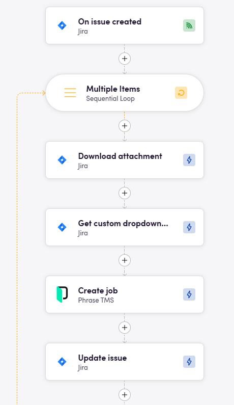
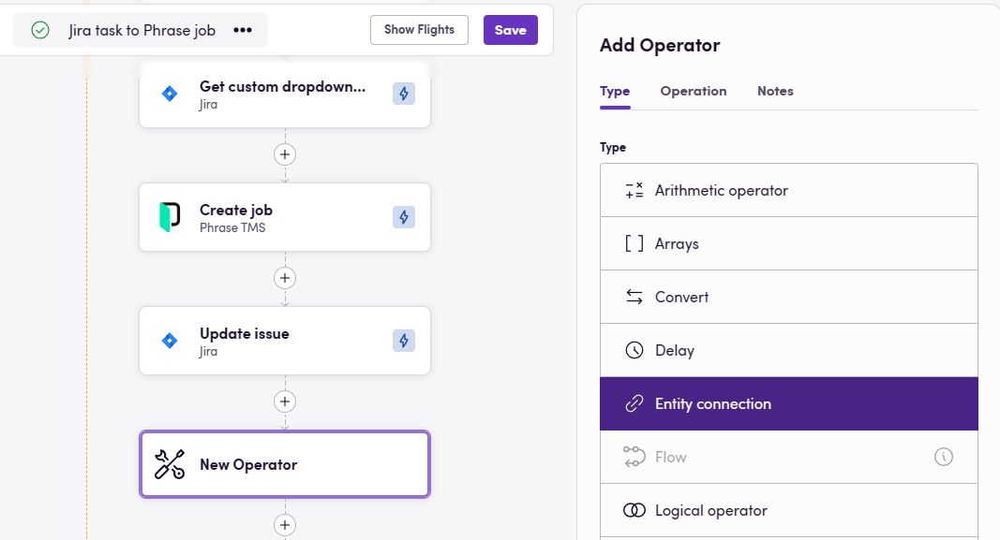

> **🚨 FONTOS MEGJEGYZÉS 🚨 Mindig próbáljuk a [checkponts](/blackbird-docs/concepts/checkpoints/) funkciót használni az entity linking helyett. A Checkpoints egy újabb funkció, amelynek célja az entity linking teljes kiváltása, így az entity linking a jövőben esetleg eltávolításra kerülhet a Blackbird-ből.** 

Most, hogy megismerted az összekötött entitások koncepcióját különböző rendszerek és platformok között az előző útmutatóban, itt az ideje megnézni, hogyan kapcsolhatod össze az entitásokat anélkül, hogy egy bizonyos rendszer egyedi értékek tárolási képességére kellene támaszkodnod. A Blackbird egy speciális operátort kínál erre a célra, amelynek neve _Link entities_. De először egy rövid összefoglaló az előző útmutatóból:

## Röviden: mik azok az összekötött entitások?

Amikor különböző rendszereket kapcsolunk össze, gyakran előfordul, hogy egy rendszerben szereplő elem szemantikailag ugyanazt reprezentálja, mint egy másik rendszerben lévő elem. Gondolj például egy CMS-ben lévő cikkre, amit egy TMS-ben egy fájl képvisel, egy ügyfélre a BMS-edben, akit egy ügyfél képvisel a CRM-edben, vagy akár egy Slack üzenetre, amely egy fordítási projektet reprezentál!

Ha a CMS cikk <> TMS fájl példát vesszük, azonosíthatunk egy nagyon gyakori mintát: amikor létrehozunk egy TMS projektet, fájlokat adunk hozzá, amelyek a CMS cikkeknek felelnek meg. Majd amikor a fordítások elkészülnek, minden cikket frissítenünk kell a megfelelő lefordított fájllal. Feltételezve, hogy a fordítás befejezett munkafolyamata különbözik a fordítási projekt létrehozásának munkafolyamatától, fel kell tennünk magunknak a kérdést: **adva ezt a lefordított fájlt, amit a TMS-emtől kaptam, melyik cikknek felelt meg?** Erre a kérdésre választ kell kapnunk, hogy a fordítást a megfelelő helyre tehessük.

Ha nem az egyéni tulajdonságok megközelítést használjuk, mint az előző útmutatóban, akkor a Blackbird natív _Link entities_ operátorát kell használnunk.

> Ha egy rendszer lehetővé teszi az egyéni tulajdonságok használatát, mindig javasoljuk, hogy ezt használd a Blackbird natív összekötött entitásai helyett, hogy nagyobb kontrollod legyen ezen tulajdonságok szerkesztése felett, ha szükséges.

## A forgatókönyvünk

Lépésről lépésre végigmegyünk ezen az operátoron. De először határozzuk meg azt a munkafolyamatot, amit építeni fogunk. Feltételezzük, hogy ez egy szétválasztott munkafolyamat, ami azt jelenti, hogy a munkafolyamat egy része egy triggeren alapul, a második része pedig egy másik triggeren. A következőképpen határozhatjuk meg:

> _Amikor új Jira jegy jön létre, vegyük a csatolmányokat és egyéb információkat, és adjuk hozzá őket egy Phrase munkához._

Majd:

> _Amikor a Phrase munka elkészül, frissítsük a Jira jegyet és töltsük fel a fordításokat._

A részletek mellőzésével a munkafolyamat első része így néz ki:

Egy ciklust használunk a problémában lévő összes csatolmány végigfutásához, majd letöltjük a csatolmányt és létrehozunk egy Phrase munkát ezekből, valamint a Jira legördülő menüjéből kiválasztott nyelvvel.

Ezután a munkafolyamat második része így fog kinézni:

Letöltjük a lefordított fájlt, és szeretnénk hozzáadni a Jira jegyünkhöz. Azonban most szembesülünk pontosan ugyanazzal a problémával, amit korábban említettünk: **adva ezt a befejezett munkát, melyik jegynek felelt meg?**

> Az entity linking minden használati esete ugyanezt a formát veszi fel: _x_ megfelel _y_-nak, van _x_-em, mi _y_?

## 1. Az entitások összekapcsolása létrehozásukkor.

Ahhoz, hogy válaszoljunk erre a kérdésre, még egy lépést hozzá kell adnunk az első munkafolyamatunkhoz. Nevezetesen, meg kell teremtenünk a kapcsolatot e két entitás között.

Kattints a `+` ikonra és válaszd az _Operator_ lehetőséget. Ezután a jobb oldali menüben válaszd az _Entity connection_ opciót.

Ezután a típusnál válaszd a _Link entities_ opciót. Most meg kell határoznunk a két entitás neveit és azonosítóit. Javasoljuk, hogy használj felismerhető neveket. Esetünkben a `Jira_issue` nevet használjuk, és kiválasztjuk az _Issue key_-t (amely a jegy azonosítója, amire a második madárban szükségünk lesz), és összekötjük a `Phrase_job` elemmel, és hozzáadjuk az éppen létrehozott Phrase munka _UID_-jét.

Kész! Most már reptethetjük ezt a madarat, és ellenőrizhetjük, hogy sikeresen működik-e. Miután hozzáadtuk a _Link entities_ operátort a madarunkhoz, most már használhatjuk ezt a kapcsolatot a másik madarunkban.

> **Megjegyzés**: Legalább egyszer sikeresen kell reptetned egy madarat az entity linkkel, hogy az entitásnevek megjelenjenek a következő lépésben!

## 2. Az entity link használata.

Térjünk vissza ahhoz a madárhoz, amely a fordítások Jirába való visszahelyezéséért felelős. A Phrase és Jira műveletek között most újra hozzáadhatjuk az _Entity connection_ operátort. Ezúttal a _Link entities_ helyett a _Get linked entity_ opciót választjuk a típusnál.

Amikor a _name_ mezőre kattintunk, egy legördülő menüt látunk az összes különböző entitástípussal, amit a Blackbird eltárolt számodra. Tudjuk, hogy van egy Phrase munkánk, és egy Jira jegyre van szükségünk, ezért kiválasztjuk a `Phrase_job` opciót és kitöltjük a Job ID-t, amit az eseményen keresztül kaptunk. Majd a kapcsolódó entitásnál a `Jira_issue` opciót választjuk.

Hurrá! Most már lekértük az összekapcsolt entitást!

Most már használhatjuk ezt az azonosítót (ami esetünkben a Jira jegy kulcsát jelenti) a végső műveletünkben a madár befejezéséhez.

Et Voila, amikor a Phrase munka elkészül, most már látjuk a csatolmányainkat a megfelelő Jira jegyben visszaadva! 🎉

> Idén később egy olyan funkción dolgozunk, amely talán helyettesítheti sok ilyen szétválasztott munkafolyamatos forgatókönyvet. Tervezzük az úgynevezett _in-bird-events_ hozzáadását, amely lehetővé teszi egy szétválasztott munkafolyamat folytatását, mintha az egy lenne. A legtöbb (ha nem minden) esetben ez megszüntetheti az entity linking szükségességét.