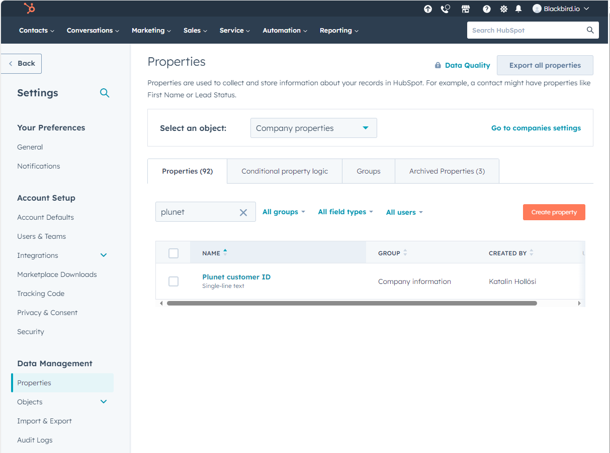
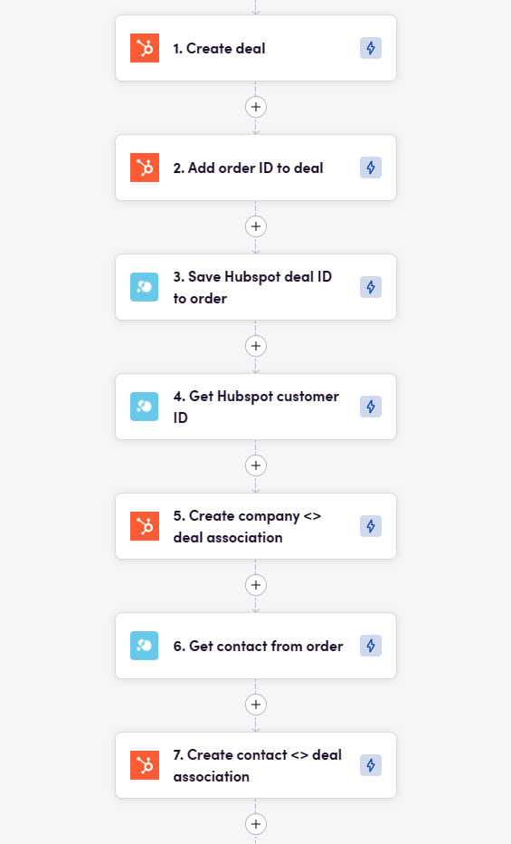

Ez az útmutató első bevezetésünk az üzleti folyamatok kezelésébe és a megoldásépítésbe. Most, hogy már ismeri az alapvető funkciókat (madarak, repülések és alkalmazások), itt az ideje elsajátítani azokat a készségeket, amelyek segítenek a legtöbbet kihozni a Blackbird-ből!

Az adatok szinkronizálása két rendszer között tipikus Blackbird használati eset. A követelmények általában így hangzanak: "Amikor új _x_ jön létre az _y_ rendszerben, szinkronizáljuk azt a _z_ rendszerbe".
Ma a Plunet és Hubspot rendszereket vesszük példaként ehhez az esethez, de természetesen ugyanez a módszertan bármely két másik rendszerre is alkalmazható.

> Megjegyzés: A cikk során, ahol Plunet megrendelésre hivatkozunk, az helyettesíthető Plunet árajánlattal vagy Plunet kéréssel, hasonlóképpen választhatja a Hubspot Árajánlatokkal való összekapcsolást is.

## 1. Követelmények

Ahogy minden tapasztalt szoftverfejlesztő elmondaná: pontos követelmények meghatározása nehéz feladat. Ez azért van, mert a szoftver világában mindent pontosan lehet definiálni, míg az emberi nyelv világában sokkal _"szabadabban"_ írjuk le, mit szeretnénk elérni. Nézzünk meg egy valós példát egy Blackbird-felhasználó követelményére:

> "Szeretnénk szinkronizálni a Plunet megrendeléseket a Hubspot üzletekkel"

Ez a követelmény még messze van egy valódi madártól. Ezért az első lépés a további részletek megszerzése. Feltételezve, hogy már tudjuk, mik a Plunet megrendelések és a Hubspot üzletek, választ kell találnunk a két legfontosabb kérdésre: **Milyen** adatokat kell szinkronizálni és **Mikor** történjen meg ez a szinkronizáció?

> "Szeretnénk létrehozni egy üzletet a Hubspotban, amikor egy megrendelés jön létre a Plunetben. Az üzlet összegét, nevét, ügyféladatait, kapcsolattartóját és projektmenedzserét kell szinkronizálni"

Ez már jobban hangzik. Akár saját munkafolyamatot valósít meg a Blackbird-ben, akár valaki más követelményeivel dolgozik, képesnek kell lennie megfogalmazni, hogy **Minek** kell történnie **Mikor**. Ha ezt az üzleti folyamatot már most is "manuálisan" hajtják végre rendszeres időközönként, akkor rendkívül értékes lehet, ha (digitálisan) leül e személy mellé, miközben elvégzi ezeket a műveleteket. Ez segíthet a rejtett követelmények feltárásában, de már a következő lépések megtételében is előnyt jelenthet. Minden esetben ajánlott, hogy egy követelményt legalább manuálisan végre lehessen hajtani, még akkor is, ha az jelenleg nem része egyetlen üzleti folyamatnak sem.

## 2. Kapcsolatok feltérképezése

Most, hogy jobban értjük, mit kell építenünk, tájékozódnunk kell arról, hogyan működnek ezek a rendszerek. Mi az ügyfél a Plunetben? Mi a megrendelés? És ami a legfontosabb: **mik az ezeknek megfelelő reprezentációk a Hubspotban?**

Kezdjük a Plunettel, de röviden:

- Több ügyfél van.
- Minden ügyfélnek lehet több kapcsolattartója.
- A Plunet "belső erőforrásokkal" rendelkezik, amelyek a szervezet embereit képviselik.
- Több megrendelés lehet, mindegyik az ügyféllel megkötött üzletet képviseli.
- Egy Plunet megrendelés egy "belső erőforráshoz" van kapcsolva projektmenedzserként, egy ügyfélhez és annak egy kapcsolattartójához.

A Hubspotban a dolgok hasonlóak, de jelentős különbséggel:

- Több vállalat van
- Több kapcsolattartó van
- Több üzlet van. Egy üzletnek van egy "üzlet tulajdonosa", aki egy Hubspot felhasználó
- E három entitás között sok-a-sokhoz kapcsolatok léteznek. A Hubspot "asszociációkat" használ ezeknek a kapcsolatoknak a nyilvántartására.

Ezek a struktúrák elég hasonlóak ahhoz, hogy leképezést készítsünk a kettő között. Azonban néhány esetben ezek a hasonlóságok nem léteznek. Ezekben az esetekben célszerű megvizsgálni, hogyan képezték le ezeket a kapcsolatokat az adott szervezetben.

Rajzoljuk fel a szemantikai kapcsolati térképet:

## 3. A kapcsolatok implementálása

Amikor szemantikai kapcsolatokkal foglalkozunk, azokat explicitté kell tennünk. Ezt azért tesszük, hogy később könnyen válaszolhassunk az olyan kérdésekre, mint: **"Ha van egy _x_ entitásom, hogyan jutok el az _y_ entitáshoz?"**. Például tudjuk, hogy egy rendszeren belül lesznek műveletek bizonyos kapcsolatok lekérdezésére. Egy Plunet megrendelés esetén könnyen megkaphatom a projektmenedzsert. Egy Hubspot vállalat esetén könnyen megkaphatom a kapcsolattartókat. Ezek a kapcsolatok és műveletek alapból elérhetők! De hogyan képezzük le az imént definiált implicit kapcsolatokat? Ha van egy Plunet megrendelésen, hogyan jutok el a megfelelő vállalathoz _a Hubspotban_?

Valahol tárolni kell a másik megfelelő entitásra való hivatkozásokat. Szerencsére mind a Plunet, mind a Hubspot lehetővé teszi, hogy egyedi mezőket hozzunk létre és állítsunk be ezekhez az entitásokhoz.

A Plunet esetében létrehozunk egy _szövegmodult_ és alkalmazzuk azt az Ügyfelekre, belső erőforrásokra és megrendelésekre. A szövegmodul neve _Hubspot ID_ lesz, hogy elmenthessük a megfelelő entitások Hubspot azonosítóit. A szövegmodulokról további információkat a [Plunet dokumentációjában](https://kb.plunet.com/display/KB/Text+modules) találhat.

A Hubspotban minden entitás rendelkezhet _Egyéni tulajdonságokkal_ (Beállítások -> Adatkezelés -> Tulajdonságok). Létrehozhatunk egy új tulajdonságot mindegyik releváns entitáson. Az egyéni tulajdonságokról további információkat a [Hubspot dokumentációjában](https://knowledge.hubspot.com/properties/create-and-edit-properties) találhat.

Létrehoztuk a két különálló rendszerünkben lévő entitások szemantikai összekapcsolásához szükséges infrastruktúrát, és készen állunk a következő lépésre!

## 4. A madár tervezése

Emlékeztessük magunkat arra a munkafolyamatra, amelyet automatizálni próbálunk:

> "Szeretnénk létrehozni egy üzletet a Hubspotban, amikor egy megrendelés jön létre a Plunetben. Az üzlet összegét, nevét, ügyféladatait, kapcsolattartóját és projektmenedzserét kell szinkronizálni"

Elérkeztünk a legfontosabb lépéshez, amelyet a madár építése előtt teszünk: a probléma kisebb lépésekre bontásához. A tipikus Blackbird munkafolyamatokra leggyakrabban alkalmazható stratégia: _milyen lépéseket tenne meg egy személy, hogy ezt a munkafolyamatot manuálisan végrehajtsa?_ - miközben már feltételezzük az általunk létrehozott korábbi "infrastruktúrát". Ha valaki nem tudja elképzelni, hogyan lehet egy munkafolyamatot manuálisan végrehajtani, akkor nem tudjuk a Blackbird-et sem erre utasítani. Ezért a manuális lépések képezik az automatizálásunk alapját.

Írjuk le a manuális lépéseket, amelyeket el kell végezni a Plunet megrendelés Hubspot üzlettel való szinkronizálásához. Feltételezzük, hogy a megrendelés már létrejött.

1. Új üzlet létrehozása a Hubspotban, és az ár, név és dátum hozzáadása a Plunet megrendelésből.
2. A Plunet megrendelési azonosító egyedi tulajdonság beállítása a Hubspotban a létrehozott Plunet megrendelés azonosítójával
3. Az üzlet létrehozása után az Üzlet azonosító lekérése a Hubspotból és hozzáadása a Plunet Hubspot ID szövegmoduljához
4. A megrendelés ügyfelének megkeresése a Plunetben és a Hubspot azonosítójának megtalálása a szövegmodulban
5. Új asszociáció létrehozása e Hubspot ügyfél és a Hubspot üzlet között
6. A megrendelés kapcsolattartójának megkeresése a Plunetben és a Hubspot azonosítójának megtalálása
7. Új asszociáció létrehozása a Hubspot kapcsolattartó és a Hubspot üzlet között

> Talán felmerül a kérdés, miért töltjük ki az egyedi tulajdonságokat és szövegmodulokat, miközben ezek nem feltétlenül szükségesek ehhez a madárhoz. Azt javasoljuk, hogy jó gyakorlatként hozzuk létre ezeket az asszociációkat a jövőbeli munkafolyamatokhoz és forgatókönyvekhez.

Úgy tűnik, hogy a madarunk elég egyszerű lesz! Körülbelül 6 műveletet hajtunk végre a Plunet és Hubspot kézi szinkronizálásakor, így hasonló méretű madárra számíthatunk.

## 5. A madár felépítése

Végre készen állunk a madár megépítésére! Ha helyesen tervezted meg a műveleteidet, akkor a madárban szereplő műveletek alapvetően megfelelnek azoknak a manuális lépéseknek, amelyeket végre kellene hajtanod.

Ahogy látható, a számozott műveletek megfelelnek a fent megtervezett lépéseknek!

Amikor már tesztelte ezt a folyamatot (javasoljuk, hogy kezdetben kézi indítással tegye ezt, és csak egy "hardkódolt" Plunet megrendelést használjon), elkezdheti átgondolni az indítót: mikor is kell ennek a madárnak repülnie?

A madárnak akkor kell aktiválódnia, _amikor új megrendelés jön létre a Plunetben_. Úgy tűnik, van egy esemény a Plunetben, amely az _On order created_. Sajnos ez az a pillanat, amikor mélyebb rendszerismeretekre lenne szükségünk a Plunetről. Nevezetesen, ez az esemény nem akkor aktiválódik, amikor egy új megrendelést először mentünk el, hanem a Plunetben abban a pillanatban, amikor rákattintunk az _új megrendelés_ gombra. Ez rendkívül használhatatlan, mivel ebben a pillanatban az egész megrendelés még üres lesz.

> Bátorítjuk, hogy kísérletezzen az eseményekkel (és műveletekkel) izolált madarakban, egyszerűen azért, hogy megismerje viselkedésüket, mielőtt nagyobb madár forgatókönyvekben használná őket.

Ne aggódjon, van egy másik esemény, amit használhatunk: _On order status changed_. Gyakori, hogy a projektmenedzserek létrehoznak egy új megrendelést, és az inicializálási fázist a megrendelés státuszának megváltoztatásával fejezik be. Ehelyett ez legyen az indítónk!

Most egy olyan probléma merül fel, hogy ezt a státuszváltoztatást többször is alkalmazhatják. Képzelje el, hogy egy projektmenedzser átállítja a státuszt, aktiválja a madarat, aztán visszaváltja és újra átállítja, ismét aktiválva azt. Most duplikált Hubspot üzleteink vannak!

A legjobb módja annak, hogy elkerüljük ezt az újonnan létrehozott problémánkat, az, ha egyszerűen az elején ellenőrizzük, hogy már beállítottuk-e a Hubspot üzlet azonosítót a Plunet szövegmodulunkban. Ha nem, akkor biztonságosan végrehajthatjuk a madár többi részét.

Ezekkel a részletekkel kiegészítve a teljes madár így néz ki:

Gratulálunk! Elvégezted a megoldásépítő összes lépését egy üzemkész madár létrehozásához!

## 6. További madarak

De várj