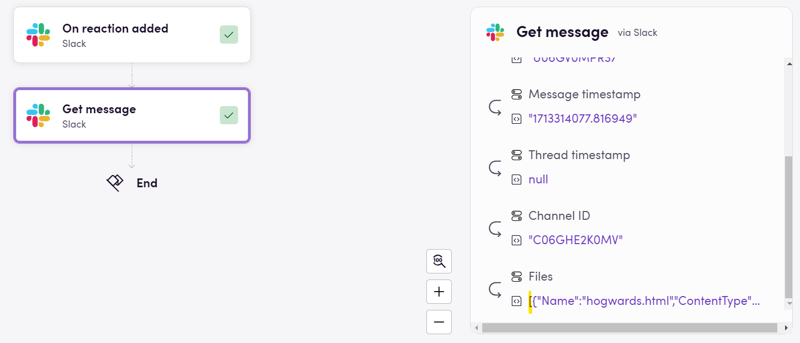
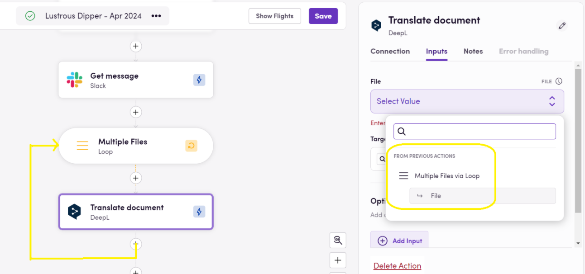
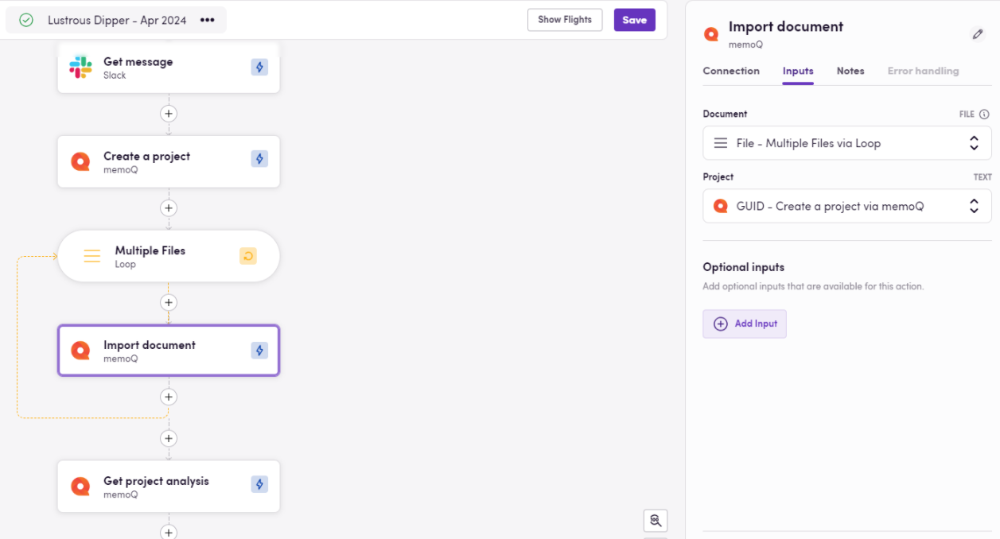

Üdvözöljük a Ciklus 101-en - az útmutatóban, amely segít elsajátítani a Blackbird.io Ciklusokat anélkül, hogy belebonyolódna a technikai zsargonba!

## Az alapok megértése
A Blackbird.io-ban a munkafolyamat műveletei néha olyan kimeneteket hozhatnak létre, amelyek csoportokban jelennek meg, mint elemkészletek. Ezeket a csoportokat tömböknek vagy listáknak nevezzük. De amikor a következő művelet csak egy elemet vár, nem egy egész csoportot, ott lép be a Ciklus.

Vegyük például ezt a "Get message" műveletet a Slack-ből. Mivel egy üzenet több mellékletet is tartalmazhat, a Blackbird.io visszaad egy "csoport" mellékletet (még akkor is, ha egy adott üzenetben csak egy melléklet van). A Flights fülön láthatjuk a szögletes zárójeleket "[]" a mellékletek "listája" körül. Ez kulcsfontosságú a tömbök azonosításához.

## Mit csinál a Ciklus?
Gondoljon a Ciklusra, mint egy segítőkész asszisztensre, aki minden elemet a csoportból egyenként vesz, és viszi át a következő műveleten. Olyan, mintha egy ellenőrzőlistán mennénk végig tételről tételre, biztosítva, hogy minden elvégzésre kerüljön.

Tegyük fel, hogy a példánkra visszatérve, szeretnénk lefordítani ezeket a csatolt fájlokat a DeepL segítségével. Tehát megkeressük a DeepL "Translate Document" műveletét. Láthatjuk, hogy ez a művelet egy Fájlt vár bemenetként. Azonban, amikor megpróbáljuk a _Magic Wand_ (Varázspálca) funkciót használni, hogy felsoroljuk az előző műveletek kimeneteit, nem látjuk a csatolt fájlokat. Ez azért van, mert az új művelet egyetlen fájlt vár, nem többet, nem egy csoportot. Itt az ideje hozzáadni egy Ciklust.

## Hogyan adjunk hozzá Ciklust?
Ugyanúgy, ahogy egy új műveletet adnánk hozzá, a pluszjelre kattintva. De ahelyett, hogy a Műveleteket, Operátorokat vagy Döntéseket választanánk, a `Loop` (Ciklus) lehetőséget választjuk. Ezután ki kell választanunk azt az "elemcsoportot", amelyen szeretnénk végigiterálni.

## Milyen műveleteket helyezzünk a ciklusba?
Azokat a műveleteket, amelyeknek ismételten kell történniük, vagy a csoportom/tömbömben lévő minden elemre vonatkozóan, a Cikluson belülre helyezzük a pluszjel újbóli használatával és az adott művelet(ek) kiválasztásával. Figyeljük meg a folyamatábrát, amely visszavezet a Ciklus kezdőpontjához, mintha önmagát ismételné (amíg el nem fogynak a csoportunkban lévő elemek).
 

## Műveletek Cikluson kívül tartása
De mi a helyzet azokkal a műveletekkel, amelyeknek nem kell minden egyes elemre megtörténniük? Azok a Cikluson kívül maradhatnak. Ezek olyan feladatok, amelyeket csak egyszer kell elvégezni, függetlenül a csoportban lévő elemek számától.

Tegyük fel, hogy a csatolt fájlokat egy memoQ projektben szeretnénk elhelyezni és forrásfájlként használni. Ha minden csatolt fájlhoz egy projektet szeretnénk létrehozni, mindössze annyit kellene tennünk, hogy egy "Create Project" műveletet helyezünk a Cikluson belülre, amely minden fájlon végigmegy. Azonban valójában azt szeretnénk, hogy egy projekt tartalmazzon minden fájlt. Ezért a "Create project" műveletnek a Cikluson kívül kell történnie, és csak az "Import Document" műveletet kell a Cikluson belül elhelyezni, amely bemenetként minden egyes fájlt vesz, és addig iterál rajtuk, amíg mind importálva nincs; ezután a folyamat folytatódik egyszeri műveletekkel, talán információkat gyűjtve az újonnan létrehozott projektemről _összességében és egyszer_.

> A könnyebb használat érdekében javasoljuk, hogy nevezze át a Ciklusát valami olyanra, ami teljesen egyértelművé teszi, hogy milyen elemeken halad végig. Ehhez használja a ceruza ikont a művelet címe mellett a jobb oldali panelen, miközben az adott művelet ki van választva.

## Összefoglalás
Gratulálunk, tollas barátaim! Sikeresen teljesítette a gyorstalpaló kurzust a Ciklusokról a Blackbird.io-val. Most, hogy elsajátította a Ciklus művészetét, terjesszük ki szárnyainkat és ültessük át a gyakorlatba!