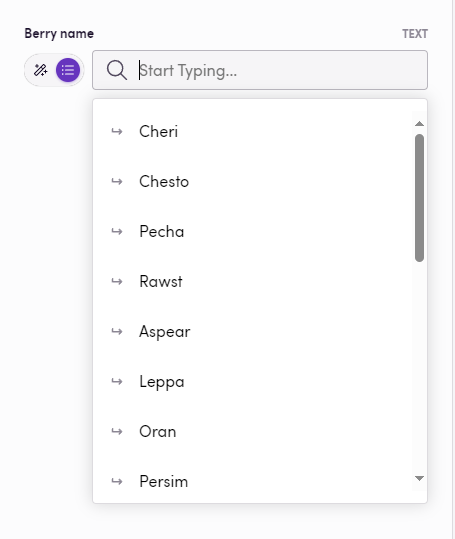

Eddig megtanultuk, hogyan határozzuk meg a kapcsolatokat, műveleteket és eseményeket. Ezek kombinációja teljes értékű, használható alkalmazást hozhat létre. Azonban a felhasználóknak valószínűleg továbbra is sok értéket kell „kemény kódolással" megadniuk, például nyelvkódokat, entitás azonosítókat, felsorolás típusú állapotokat stb. Ezért hoztuk létre az _Adatforrásokat_. Az adatforrások lehetővé teszik, hogy bizonyos bemeneti paraméterekhez (mind a műveleteknél, mind az eseményeknél) meghatározza, milyen adatokat jelenítsen meg a Blackbird egy legördülő listában. Ez időt takarít meg a felhasználónak, mivel nem kell másolnia és beillesztenie értékeket! Két típusú adatforrás létezik: _statikus adatforrások_ és _dinamikus adatforrások_. A statikus adatforrások lehetővé teszik, hogy véges listát definiáljon olyan értékekből, amelyek soha nem változnak. Erre példa lehet a projekt különböző állapotai. A dinamikus adatforrások lehetővé teszik, hogy a felhasználó kapcsolata alapján dinamikus tartalmat kérjen le. Erre példa lehet a meglévő projektek listája. Először megnézzük, hogyan működnek a dinamikus adatforrások, majd áttérünk a statikus adatforrásokra.

## Dinamikus adatforrások

Nézzük meg egy dinamikus adatforrás felépítését:

```cs
/// <summary>
/// Data source handler for asynchronous dynamic inputs.
/// It provides static data on the UI, so that user can choose values from the dropdown instead of printing it manually.
/// </summary>
public class AsyncDataSourceHandler : AppInvocable, IAsyncDataSourceItemHandler
{
    public AsyncDataSourceHandler(InvocationContext invocationContext) : base(invocationContext)
    {
    }

    /// <summary>
    /// Fetches data for the dynamic inputs and returns it as a list of options.
    /// </summary>
    public async Task<IEnumerable<DataSourceItem>> GetDataAsync(DataSourceContext context, CancellationToken cancellationToken)
    {
        var request = new AppRestRequest(ApiEndpoints.Berry, Method.Get, Creds);
        var response = await Client.ExecuteWithHandling<ListResponse<Berry>>(request);

        return response.Results
            // We need to pay attention to SearchString in the context
            // So that we return only values that match user search request
            .Where(x => context.SearchString == null ||
                        x.Name.Contains(context.SearchString, StringComparison.OrdinalIgnoreCase))
            .Select(x => new DataSourceItem(x.Id, x.Name));
    }
}
```

Látható, hogy az adatforrás 'kezelő' osztály örökölhet a `BaseInvocable`-ból, ami azt jelenti, hogy teljes hozzáféréssel rendelkezik a kontextushoz (beleértve a hitelesítési adatokat is).

A `DataSourceContext.SearchString` a felhasználó által beírt keresési karakterláncot biztosítja. Ezt használhatja az eredmény szűrésére.

Vissza kell adnia egy `IEnumerable<DataSourceItem>` típusú eredményt, ahol a `DataSourceItem` `value` argumentuma azt az értéket képviseli, amely "kitöltésre" kerül, például egy bizonyos állapot vagy entitás azonosítója. A második argumentum a megjelenített név.



### Speciális kontextus

A keresési karakterláncon kívül még több kontextushoz is hozzáférhet. Mi van akkor, ha tudni szeretné a műveletben kiválasztott egyéb mezők értékeit? Átadhat egy `[ActionParameter]`-t a konstruktornak, hogy láthassa a felhasználó által kitöltött többi mezőt.

```cs
public class DataSourceHandlerWithParameters : AppInvocable, IAsyncDataSourceItemHandler
{
    // Saving input model to use it while fetching data
    private readonly DataSourceWithParametersRequest _request;

    protected DataSourceHandlerWithParameters(InvocationContext invocationContext,
        // Specifying the same model where DataSourceHandlerWithParameters was added
        [ActionParameter] DataSourceWithParametersRequest request) : base(invocationContext)
    {
        _request = request;
    }

    public async Task<IEnumerable<DataSourceItem>> GetDataAsync(DataSourceContext context, CancellationToken cancellationToken)
    {
        // Throwing error if parameters are not specified
        if (string.IsNullOrWhiteSpace(_request.Url))
            throw new("You should input URL first");

        if (string.IsNullOrWhiteSpace(_request.EntityId))
            throw new("You should input Entity ID first");

        // Fetching data based on provided parameters
        var request = new AppRestRequest($"{_request.Url}/{_request.EntityId}", Method.Get, Creds);
        return await Client.ExecuteWithHandling<IEnumerable<DataSourceItem>>(request);
    }
}
```

### Használat

Egyszerűen adja hozzá a `[DataSource]` attribútumot bármely `string` vagy `IEnumerable<string>` típusú bemeneti értékhez, és a szabad szövegbeviteli mező legördülő menüvé változik!

```cs
public class GetBerryRequest
{
    // Properties must have display attributes which contain user-friendly name of variable
    [Display("Berry name", Description = "The name of the berry")]
    // Applying data source handler to the property
    [DataSource(typeof(AsyncDataSourceHandler))]
    public string BerryName { get; set; }
}
```

## Statikus adatforrások

A statikus adatforrások nagyon hasonlóak a dinamikus adatforrásokhoz. A fő különbség a használatban az interfész és az attribútumok, amelyeket a megvalósításhoz kell használnia. Másodszor, figyelembe kell vennie, hogy nem férhet hozzá a kapcsolati kontextushoz. Ehelyett egyszerűen vissza kell adnia egy előre meghatározott `IEnumerable<DataSourceItem>` gyűjteményt.

A Blackbird ezeket a statikus adatforrásokat a fordítás során fordítja le, ami azt jelenti, hogy amikor valaki használja az alkalmazását, nem fog betöltési ikont látni, amikor egy statikus legördülő menüre kattint. Ehelyett az értékek azonnal megjelennek.

> Ha az alkalmazása nem töltődik fel megfelelően a Blackbird-re, az lehet, hogy ismétlődő értékek vannak a statikus adatforrásaiban.

Statikus adatforrás osztály:

```cs
public class StaticDataSourceHandler : IStaticDataSourceItemHandler
{
    public IEnumerable<DataSourceItem> GetData() =>
    [
        new("water_electric", "Water/Electric"),
        new("fighting_psychic", "Fighting/Psychic"),
        new("grass_flying", "Grass/Flying"),
    ];
}
```

És használata attribútumként:

```cs
    [Display("Pokemon type")]
    [StaticDataSource(typeof(StaticDataSourceHandler))]
    public string PokemonType { get; set; }
```