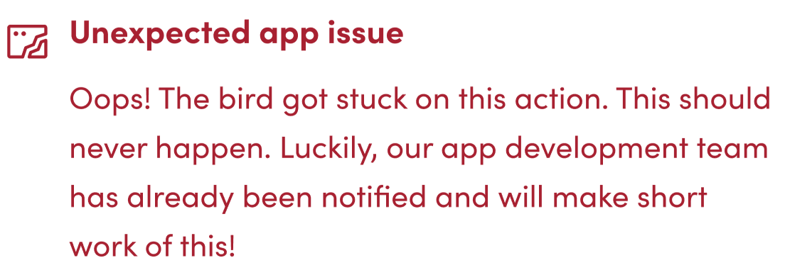

Amikor a kód hibát dob, ez a hiba leállítja az akciót és a madarat, és megjeleníti a felhasználó számára a repülések oldalon.

A repülések oldalon 5 különböző típusú hiba jeleníthető meg. 2 típusú hibát a Blackbird core dob, a másik 3-at az alkalmazás kódja dobhatja. Itt megvitatjuk mindezen hibákat és azt, hogyan dobhatók.

## 1. Konfigurációs hiba


Ennek a hibának a célja, hogy értesítse a felhasználót arról, hogy **hibát követett el**, és **csak ő tudja megoldani**. Ez általában helytelenül konfigurált változók, értékek vagy környezetek esetén fordul elő. Ezért ezt a hibatípust *konfigurációs hibának* nevezzük. Konfigurációs hibák példái:

- Helytelen fájltípus küldése.
- Olyan értékek küldése, amelyek hibásnak tűnnek az elemzés során.
- A csatlakoztatott alkalmazás által előírt korlátok túllépésének kísérlete.
- Amikor a csatlakoztatott alkalmazás hitelesítési vagy engedélyezési problémát jelez (401).
- Projektek létrehozása valamilyen illegális konfigurációban.

Amikor konfigurációs hibát dobunk, a leírásnak **meg kell mondania a felhasználónak, hogyan oldja meg a problémát**.

A konfigurációs hiba a `PluginMisconfigurationException` osztályú kivétel dobásával dobható. Egy példa, a memoQ alkalmazásból véve, alább látható:

```cs
try
{
    var result = projectService.Service.CreateProjectFromTemplate(newProject);
    var response = projectService.Service.GetProject(result.ProjectGuid);

    return new(response);

} catch (System.ServiceModel.FaultException ex)
{
    if (ex.Message == "Message.ResourceNotFound.ProjectTemplate")
        throw new PluginMisconfigurationException("A kiválasztott projektsablon nem létezik. Kérjük, válasszon másik sablont.");
    else if (ex.Message == "An online project with the same name already exists.")
        throw new PluginMisconfigurationException("Már létezik azonos nevű online projekt. Kérjük, állítson be egyedi nevet.");
    throw;
}
```

> **Megjegyzés**: Ezt a hibát általában akkor is dobjuk, amikor ellenőrizzük, hogy a beviteli paraméterek helyesek-e.

## 2. Az alkalmazás nem válaszol


Ennek a hibának a célja, hogy értesítse a felhasználót arról, hogy **a csatlakoztatott alkalmazásnak olyan problémái vannak, amelyekkel sem Ön** (az alkalmazásfejlesztő), **sem a felhasználó nem tud mit kezdeni**. Ez általában akkor fordul elő, amikor az alkalmazás váratlan problémát dob (500), vagy amikor az API olyan hibát dob, amely a felhasználónak, nem pedig az alkalmazásfejlesztőnek szól. Példák:

- Amikor egy API-kérés hibakódja 500 (mint már említettük).
- Amikor a csatlakoztatott alkalmazás nem elérhető (nem lehet elérni).
- Amikor elérünk egy bizonyos rátakorlátot (amely nem oldható meg várakozással és újrapróbálkozással az alkalmazásban).

Az alkalmazás nem válaszol hiba a `PluginApplicationException` osztállyal dobható.

> **Megjegyzés**: Ezt a hibát általában egy alap rest kliens osztályban lehet kezelni, amely a legtöbb API-hívást kezeli.

## 3. Váratlan alkalmazásprobléma



Minden más hiba, amelyet az alkalmazása dob, *váratlan hibaként* jelenik meg. A cél a **váratlan hibák számának minimalizálása**. Ha váratlan hiba jelentkezik, az alkalmazásfejlesztő felelőssége, hogy vagy kezelje a hibát a kódban, vagy a másik 2 hibatípus valamelyikét dobja.

Röviden:

- Ha sem a felhasználó, sem az alkalmazásfejlesztő nem tehet semmit -> `PluginApplicationException`.
- Ha a felhasználónak kell valamit tennie -> `PluginMisconfigurationException`.
- Ha az alkalmazásfejlesztőnek kell valamit tennie -> bármilyen más kivétel.

Néhány további irányelv:

- Fogja el a standard HTTP-hibákat. Pl. 401 Unauthorized esetén tájékoztatni kell a felhasználót, hogy a hitelesítő adatai hibásak lehetnek.
- Ha a végpontok további információt adnak a törzsükben (esetleg valamilyen json-ban), akkor ezt az információt kell továbbítani a felhasználónak, nem pedig egy egyszerű "400 bad request" üzenetet.
- A futásidejű hibákat mindenáron el kell kerülni. Ellenőrizze a null referenciákat, üres tömböket stb. Az IDE-ben nem szabad figyelmeztetéseknek lenniük.
- Ne felejtse el ellenőrizni, hogy a JSON-elemzés megfelelően működik-e, és tájékoztassa a felhasználót, ha probléma van.
- Előre ellenőrizze, hogy a felhasználó által használt beviteli paraméterek helyesek-e. Ha nem, tájékoztassa a felhasználót, hogyan javítsa ki őket.