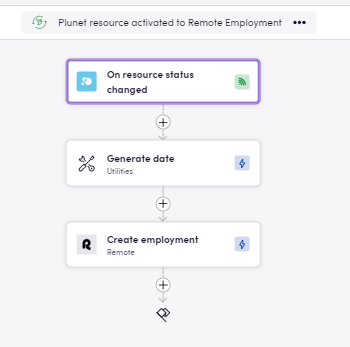
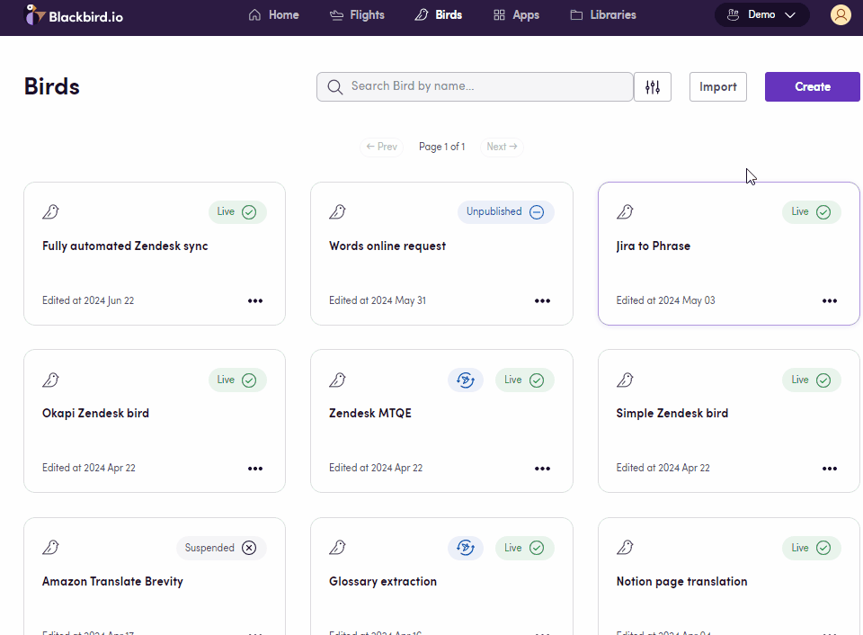

### Eggs: Startpunten voor je Birds

In Blackbird zijn Eggs de zaden of blauwdrukken voor je workflows. Ze vertegenwoordigen de initiële ideeën die het potentieel hebben om volledig ontwikkelde Birds te worden.

In deze Egg-gids verkennen we enkele opties om [Remote.com](https://docs.blackbird.io/apps/remote/) te integreren met verschillende apps. Vind **Downloadbare Eggs** onder elk gebruiksgeval - download JSON-workflows om [in je Nest te importeren](https://docs.blackbird.io/eggs/remote/#importing-eggs), voeg je verbindingen toe, maak gewenste aanpassingen en **vlieg**.

## Gebruiksvoorbeelden

### TBMS resource naar Remote dienstverband

> TBMS verwijst naar Translation Business Management Systems. Apps zoals Plunet, XTRF of Bureau Works vallen in deze categorie.

De Bird hieronder maakt een nieuw dienstverband aan in Remote zodra een nieuwe Resource als Actief is ingesteld in Plunet.

- Download Egg: <a href="https://docs.blackbird.io/downloads/Plunet_resource_activated_to_Remote_Employment.json" download>On Plunet resource activated create Remote employment</a>
- Download Egg: <a href="https://docs.blackbird.io/downloads/Remote_employment_completed_set_Plunet_resource_Active.json" download>On Remote employment completed set Plunet resource active</a>

### TBMS Facturen naar Remote

Deze Bird wordt wekelijks geactiveerd, zoekt facturen in XTRF die in de afgelopen week zijn bijgewerkt, exporteert ze en importeert ze in Remote. Let op de Convert-operator die wordt gebruikt om gegevens uit een aangepaste bibliotheek te halen.

- Download Egg: <a href="https://docs.blackbird.io/downloads/XTRF_invoice_to_Remote.json" download>XTRF invoice to Remote</a>
- Download Egg: <a href="https://docs.blackbird.io/downloads/Remote_to_XTRF_invoice_status_update.json" download>Remote to XTRF invoice status update</a>

### Bij Remote-triggers stuur notificaties, log gegevens, voeg agenda-items toe

De onderstaande afbeelding toont een Bird die wordt geactiveerd wanneer een verlofaanvraag is goedgekeurd in Remote. Deze voegt vervolgens een afspraak toe aan de Microsoft 365-agenda, logt de verlofgegevens in een Excel-bestand en stuurt een Slack-notificatie.

- Download Egg: <a href="https://docs.blackbird.io/downloads/On_timeoff_approved_add_to_Calendar_Excel.json" download>On timeoff approved add to calendar and Excel</a>
- Download Egg: <a href="https://docs.blackbird.io/downloads/Manual_payout_notification.json" download>Monthly manual payout notification</a>

## Tips

- **Gegevens tussen apps in kaart brengen:** Om belangrijke gegevenspunten die naar hetzelfde verwijzen (bijv. Contractor ID in Remote en Resource ID in Plunet) in kaart te brengen, zijn er verschillende opties:
    - [Aangepaste bibliotheken](https://docs.blackbird.io/concepts/libraries/#custom-libraries) kunnen worden gebruikt om je gegevensmapping op te zetten en te gebruiken binnen je Birds via de Convert-operator, op dezelfde manier als je een VLookup-formule in Excel zou gebruiken.
    - Aangepaste velden. Veel apps bieden aangepaste velden die je naar eigen wens kunt definiëren.
    - [Gekoppelde entiteiten](https://docs.blackbird.io/guides/entity-linking/).
- **Optionele invoer:** Bekijk de verschillende invoeropties, vooral bij de gebeurtenistriggers, aangezien deze je opties bieden om te filteren wanneer een Bird moet worden geactiveerd. Als voorbeeld, als je een "on status update" gebeurtenistrigger gebruikt, vind je waarschijnlijk de optie om te specificeren welke status het proces moet starten.

### Eggs importeren

Om een Egg in je Nest te importeren:

1. Navigeer naar het Bird Editor-gedeelte.
2. Klik op Importeren rechtsboven.
3. Selecteer het Egg (JSON) bestand om te importeren en klik op `Import`.
4. Identificeer de nieuw aangemaakte Bird en klik erop om deze te bewerken.
5. Werk de Verbindingsgegevens bij en eventuele andere benodigde invoer-/uitvoerparameters of gewenste stappen. Let op rode waarschuwingstekens naast de stapnaam die ontbrekende details in die stap signaleren.
6. Klik op Opslaan/Publiceren.

