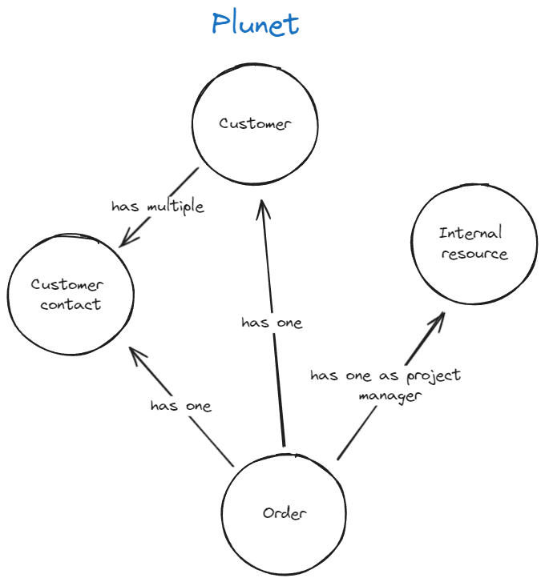
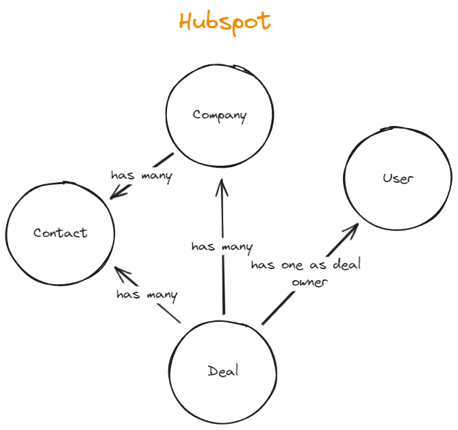
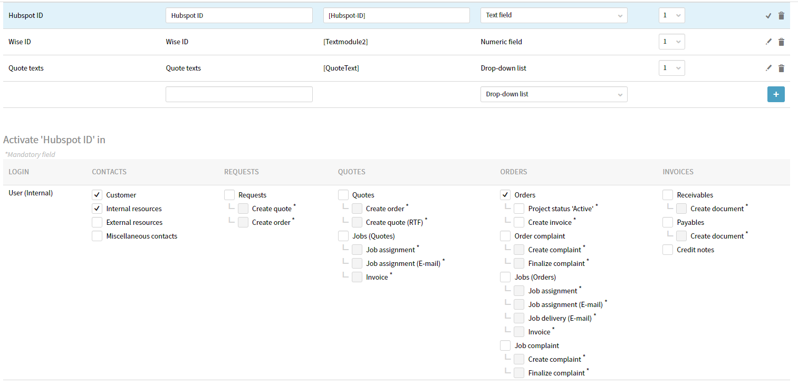
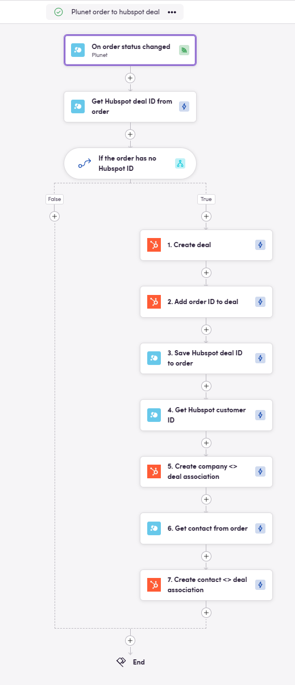

Deze gids is onze eerste introductie tot bedrijfsprocesmanagement en oplossingsarchitectuur. Nu je weet hoe je de basisfunctionaliteit (birds, flights en apps) kunt gebruiken, is het tijd om de soft skills te leren die je helpen het meeste uit Blackbird te halen!

Gegevenssynchronisatie tussen twee systemen is een typisch Blackbird gebruiksgeval. Meestal zijn de vereisten in de vorm van: "Wanneer een nieuwe _x_ wordt aangemaakt in systeem _y_, synchroniseer het dan naar systeem _z_".
Vandaag nemen we Plunet en Hubspot als voorbeeldsystemen voor dit geval, maar natuurlijk kan dezelfde methodologie worden toegepast op elk ander tweetal systemen.

> Opmerking: In dit artikel kan overal waar we verwijzen naar Plunet order ook Plunet offerte of Plunet aanvraag worden gebruikt, en je kunt er ook voor kiezen om te koppelen met Hubspot Quotes.

## 1. Vereisten

Zoals elke ervaren softwareontwikkelaar je zal vertellen: het verkrijgen van nauwkeurige vereisten is moeilijk. Dit komt omdat in de softwarewereld alles precies kan worden gedefinieerd, maar in de wereld van menselijke taal we vaak veel _"vrijer"_ zijn in onze beschrijvingen van wat we willen bereiken. Laten we eens kijken naar een praktijkvoorbeeld van een vereiste van een Blackbird-gebruiker:

> "We willen Plunet orders synchroniseren met Hubspot deals"

Deze vereiste is nog ver verwijderd van een daadwerkelijke bird. Dus de eerste stap is om meer details te krijgen. Aangenomen dat we al weten wat Plunet orders en Hubspot deals zijn, moeten we een antwoord vinden op de twee meest relevante vragen: **Welke** gegevens moeten worden gesynchroniseerd en **Wanneer** moet deze synchronisatie plaatsvinden?

> "We willen een deal in Hubspot aanmaken wanneer een order wordt aangemaakt in Plunet. Het dealsbedrag, de naam, de klant, de contactpersoon en de projectmanager moeten worden gesynchroniseerd"

Dat klinkt al beter. Of je nu je eigen workflows implementeert in Blackbird, of je werkt met de vereisten van iemand anders, je moet kunnen articuleren **Wat** er moet gebeuren **Wanneer**. Als dit bedrijfsproces eigenlijk al "handmatig" wordt uitgevoerd op periodieke basis, dan kan het zeer waardevol zijn om (digitaal) naast deze persoon te zitten terwijl zij hun acties uitvoeren. Het kan helpen bij het vinden van verborgen vereisten, maar geeft je ook al een voorsprong op de stappen die we hierna moeten nemen. In alle gevallen wordt aanbevolen dat een vereiste op zijn minst handmatig kan worden uitgevoerd, zelfs als het vandaag geen deel uitmaakt van een bedrijfsproces.

## 2. Relatietoewijzing

Nu we een beter begrip hebben van wat we moeten bouwen, moeten we inzicht krijgen in hoe deze systemen werken. Wat is een klant in Plunet? Wat is een order? En het belangrijkste: **wat zijn de equivalente representaties in Hubspot?**

Laten we beginnen met Plunet, maar laten we kort zijn:

- Er zijn meerdere klanten.
- Elke klant kan meerdere contactpersonen hebben.
- Plunet heeft 'interne resources' die mensen in jouw organisatie vertegenwoordigen.
- Er kunnen meerdere orders zijn, die elk zakelijke afspraken met een klant vertegenwoordigen.
- Een Plunet order is gekoppeld aan een 'interne resource' als projectmanager, een klant en een contactpersoon van die klant.

In Hubspot zien dingen er vergelijkbaar uit, maar met een significant verschil:

- Er zijn meerdere bedrijven
- Er zijn meerdere contacten
- Er zijn meerdere deals. Een deal heeft een 'deal eigenaar' die een Hubspot-gebruiker is
- Tussen deze drie entiteiten bestaan veel-op-veel relaties. En Hubspot gebruikt 'associaties' om deze relaties bij te houden.

Deze structuren zijn vergelijkbaar genoeg om een toewijzing tussen de twee te maken. In sommige gevallen bestaan deze overeenkomsten echter niet. In die gevallen is het verstandig om te onderzoeken hoe mensen deze relaties in hun organisatie hebben toegewezen.

Laten we de semantische relatiekaart tekenen:

## 3. Implementatie van de relaties

Wanneer we te maken hebben met semantische relaties, moeten we deze ook expliciet maken. We doen dit zodat we later gemakkelijk antwoorden kunnen hebben op vragen van het type **"Ik heb entiteit _x_, hoe krijg ik nu entiteit _y_?"**. We weten bijvoorbeeld dat we binnen één systeem acties zullen hebben om bepaalde relaties te krijgen. Gegeven een Plunet order kan ik gemakkelijk de projectmanager krijgen. Gegeven een Hubspot bedrijf kan ik gemakkelijk de contacten krijgen. Deze relaties en acties komen uit de doos! Maar hoe moeten we de impliciete relaties toewijzen die we zojuist hebben gedefinieerd? Gegeven dat ik een Plunet order heb, hoe krijg ik het equivalent bedrijf _in Hubspot_?

Ergens moeten referenties naar de andere equivalente entiteit worden opgeslagen. Gelukkig staan zowel Plunet als Hubspot ons toe om aangepaste velden te maken en in te stellen voor elk van deze entiteiten.

Voor Plunet maken we een _tekstmodule_ en passen deze toe op Klanten, interne resources en orders. De naam van de tekstmodule zal _Hubspot ID_ zijn, zodat we de Hubspot-ID's van equivalente entiteiten kunnen opslaan. Voor meer informatie over tekstmodules, zie de [Plunet documentatie](https://kb.plunet.com/display/KB/Text+modules).

In Hubspot kan elke entiteit ook _Aangepaste eigenschappen_ hebben (Instellingen -> Gegevensbeheer -> Eigenschappen). We kunnen een nieuwe eigenschap maken op elk van onze relevante entiteiten. Voor meer informatie over aangepaste eigenschappen, zie de [Hubspot documentatie](https://knowledge.hubspot.com/properties/create-and-edit-properties)

We hebben de infrastructuur gecreëerd die nodig is om de entiteiten in onze twee afzonderlijke systemen semantisch te koppelen en we zijn klaar om naar de volgende stap te gaan!

## 4. Planning van de bird

Laten we onszelf herinneren aan de workflow die we proberen te automatiseren:

> "We willen een deal in Hubspot aanmaken wanneer een order wordt aangemaakt in Plunet. Het dealsbedrag, de naam, de klant, de contactpersoon en de projectmanager moeten worden gesynchroniseerd"

We zijn aangekomen bij de belangrijkste stap die je neemt voordat je de bird bouwt: het opsplitsen van een probleem in kleine stappen. De strategie die het vaakst kan worden toegepast voor typische Blackbird-workflows is _welke stappen zou een persoon nemen om deze workflow handmatig uit te voeren?_ - terwijl we al uitgaan van de eerder gecreëerde 'infrastructuur'. Als er geen manier is om een workflow handmatig uit te voeren, dan is er ook geen manier om Blackbird te instrueren dit te doen. Daarom zijn de handmatige stappen de basis van onze automatisering.

Laten we de handmatige stappen opschrijven die men moet uitvoeren om hun Plunet order te synchroniseren met een Hubspot deal. We gaan ervan uit dat de order al is aangemaakt.

1. Maak een nieuwe deal aan in Hubspot en voeg de prijs, naam en datum toe van onze Plunet order.
2. Stel de aangepaste eigenschap Plunet order ID in Hubspot in met de ID van de Plunet order die we hebben aangemaakt
3. Na het aanmaken van de deal, haal de Deal ID op van Hubspot en voeg deze toe aan de Hubspot ID tekstmodule in Plunet
4. Ga naar de klant van de order in Plunet en zoek zijn Hubspot ID uit de tekstmodule
5. Maak een nieuwe associatie tussen deze Hubspot klant en de Hubspot deal
6. Ga naar het contact van de order in Plunet en zoek zijn Hubspot ID
7. Maak een nieuwe associatie tussen het Hubspot contact en de Hubspot deal

> Je vraagt je misschien af waarom we de aangepaste eigenschappen en tekstmodules invullen terwijl ze niet noodzakelijk vereist zijn voor deze bird. We raden aan dat dit een goede praktijk is om deze associaties te maken voor toekomstige workflows en scenario's.

Dus het lijkt erop dat onze bird vrij eenvoudig gaat zijn! We voeren ongeveer 6 acties uit bij het handmatig synchroniseren van Plunet naar Hubspot, we kunnen dus een bird van ongeveer dezelfde grootte verwachten.

## 5. Bouwen van de bird

Eindelijk zijn we klaar om de bird te bouwen! Als je je acties correct hebt gepland, zouden de acties in je bird in wezen moeten overeenkomen met de handmatige stappen die je zou moeten uitvoeren.

Zoals je kunt zien, komen de genummerde acties overeen met de stappen die we hierboven hebben gepland!

Wanneer je deze flow op zichzelf hebt getest (we raden aan om dit aanvankelijk te doen met een handmatige trigger en gewoon een 'hardcoded' Plunet order te pakken) kun je beginnen na te denken over de trigger: wanneer moest deze bird ook alweer vliegen?

De bird moet triggeren _wanneer een nieuwe order wordt aangemaakt in Plunet_. Het lijkt erop dat er een gebeurtenis is in Plunet genaamd _On order created_. Helaas is dit het moment waarop we wat diepere systeemkennis van Plunet nodig zouden hebben. Namelijk, deze gebeurtenis wordt niet getriggerd wanneer een nieuwe order voor het eerst wordt opgeslagen, maar wordt getriggerd in Plunet op het moment dat je op de knop _nieuwe order_ klikt. Dit is extreem nutteloos omdat op dat moment de hele order nog leeg zal zijn.

> We moedigen je aan om te experimenteren met gebeurtenissen (en acties) in geïsoleerde birds, simpelweg om vertrouwd te raken met hun gedrag, voordat je ze gebruikt in grotere bird scenario's.

Geen zorgen, er is een andere gebeurtenis die we kunnen gebruiken: _On order status changed_. Het is gebruikelijk voor projectmanagers om een nieuwe order aan te maken en de initialisatiefase af te ronden door de orderstatus te wijzigen. Dit zou in plaats daarvan onze trigger moeten zijn!

Een probleem dat nu ontstaat, is dat deze statuswijziging meerdere keren kan worden toegepast. Stel je voor dat een projectmanager wijzigt naar onze status, de bird triggert, de status heen en weer verandert en deze opnieuw triggert. Nu hebben we dubbele Hubspot deals!

De beste manier om dit nieuwe probleem dat we voor onszelf hebben gecreëerd te omzeilen, is door in het begin gewoon te controleren of we de Hubspot deal ID al hebben ingesteld in onze Plunet tekstmodule. Zo niet, dan kunnen we de rest van de bird veilig uitvoeren.

Met die details toegevoegd, ziet onze complete bird er zo uit:

Gefeliciteerd! Je hebt alle stappen van de oplossingsarchitect genomen om een productie-klare bird te maken!

## 6. Aanvullende birds

Maar wacht! Om deze bird daadwerkelijk effectief te laten zijn in productie, moet ik de relatie (ingevulde tekstmodules) tussen Hubspot bedrijven en Plunet klanten al hebben aangemaakt. Ook vertrouwen we op de relatie tussen Plunet contact en Hubspot contact.

Scherpe observatie.

We zouden onze projectmanagers kunnen vragen om een Plunet klant aan te maken telkens wanneer een Hubspot bedrijf wordt aangemaakt en de twee te associëren door het invullen van de tekstmodules en aangepaste eigenschappen...

We zouden onze projectmanagers kunnen vragen om een Plunet contact aan te maken telkens wanneer een Hubspot contact wordt aangemaakt en de twee te associëren door het invullen van de tekstmodules en aangepaste eigenschappen...

...of we kunnen gewoon twee birds meer maken en dit proces automatiseren.

Om de laatste twee secties niet te herhalen, laten we het eenvoudig houden en kort zijn. De bird voor contacten is zeer vergelijkbaar met die van klanten, dus we zullen alleen de klantenworkflow laten zien.

> In dit voorbeeld gaan we ervan uit dat bedrijven en contacten voornamelijk in Hubspot leven, aangezien dat is waar de verkoopafdeling ze aanmaakt bij het eerste contact.

Vereiste: _We willen een klant aanmaken in Plunet wanneer een bedrijf wordt aangemaakt in Hubspot_

Handmatige stappen (nadat een bedrijf is aangemaakt in Hubspot):

1. Haal de bedrijfsinformatie op uit Hubspot
2. Maak een nieuwe klant aan in Plunet
3. Stel de Hubspot ID tekstmodule van de Plunet klant in
4. Stel de aangepaste eigenschap Plunet ID in Hubspot in

Bird:

> Het grootste verschil tussen klanten en contacten in Plunet is dat contacten geen tekstmodules hebben. Gelukkig hebben ze in plaats daarvan een "extern ID" eigenschap die we kunnen gebruiken.

Gefeliciteerd dat je helemaal tot het einde hebt gelezen! Hopelijk hebben we laten zien dat het opzetten van een Blackbird-workflow veel dieper gaat dan alleen spelen in Blackbird. Soms moet je wat dieper duiken in hoe deze systemen bedoeld zijn om te worden gebruikt, hoe