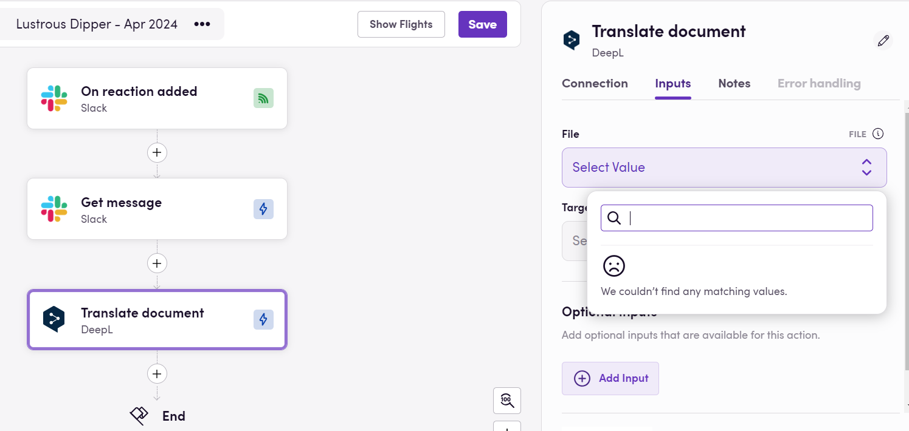

Welkom bij Looping 101 - jouw gids om Blackbird's Loops te beheersen zonder verstrikt te raken in technisch jargon!

## De basis begrijpen
In Blackbird kunnen acties in een workflow soms outputs produceren die in groepen komen, zoals verzamelingen van items. Deze groepen staan bekend als arrays of lijsten. Maar wanneer de volgende actie slechts één item verwacht, niet een hele groep, dan komt de Loop in actie.

Neem deze "Get message" actie van Slack. Omdat een bericht meerdere bijlagen kan bevatten, geeft Blackbird een "groep" bijlagen terug (zelfs als een specifiek bericht slechts één bijlage heeft). Als we naar het tabblad Flights kijken, zien we vierkante haakjes "[]" rond de "lijst" van bijlagen. Dit is cruciaal voor het identificeren van arrays.

## Wat doet de Loop?
Zie de Loop als een behulpzame assistent die elk item in de groep, één voor één neemt en het door de volgende actie voert. Het is alsof je een checklist punt voor punt afwerkt, waarbij alles wordt uitgevoerd.

Laten we zeggen, teruggaand naar ons voorbeeld, dat we die bijgevoegde bestanden willen vertalen via DeepL. Dus zoeken we DeepL's "Translate Document" actie op. We zien dat deze actie een bestand verwacht als een van de inputs. Echter, wanneer we de _Magic Wand_ proberen om de outputs van onze vorige acties weer te geven, zien we onze bijgevoegde bestanden niet in de lijst staan. Dit komt omdat de nieuwe actie één enkel bestand verwacht, niet meerdere, niet een groep. Tijd om een Loop toe te voegen.

## Hoe voeg je een Loop toe?
Op dezelfde manier als een nieuwe actie zou worden toegevoegd, door op het plusteken te klikken. Maar in plaats van Actions, Operators of Decisions te kiezen, selecteren we `Loop`. Daarna moet de "groep items" die we willen doorlopen worden geselecteerd.

## Welke acties plaats je erbinnen?
Acties die herhaaldelijk moeten gebeuren, of voor elk item in mijn groep/array, worden in de Loop geplaatst door opnieuw op het plusteken te klikken en de betreffende actie(s) te selecteren. Let op de stroomlijnen die teruggaan naar het beginpunt van de Loop, alsof ze zichzelf herhalen (totdat we door alle items in de groep heen zijn).

## Acties buiten de Loop houden
Maar wat met acties die niet voor elk individueel item hoeven te gebeuren? Die kunnen buiten de Loop blijven. Dit zijn taken die slechts één keer gedaan hoeven te worden, ongeacht het aantal items in de groep.

Stel dat we onze bijgevoegde bestanden in een memoQ-project willen plaatsen en ze als bronbestanden willen gebruiken. Als we één project per bijgevoegd bestand zouden willen maken, zou alles wat we moeten doen een "Create Project" actie binnen de Loop plaatsen die door elk bestand gaat. Maar we willen eigenlijk één project dat al onze bestanden bevat. Daarom moet de "Create project" actie buiten mijn Loop plaatsvinden, en alleen "Import Document" binnen de Loop opnemen, waarbij elk afzonderlijk bestand als input wordt genomen en door ze wordt geïtereerd totdat alle bestanden zijn geïmporteerd; dan zal de stroom verdergaan met individuele acties, misschien om informatie te krijgen van mijn nieuw aangemaakte project _in zijn geheel en eenmalig_.

> Voor het gebruiksgemak raden we aan om je Loop te hernoemen naar iets dat voor jou absoluut duidelijk maakt welke items je doorloopt. Gebruik hiervoor het potloodpictogram naast je actietitel in het rechterpaneel, terwijl de betreffende actie is geselecteerd.

## Alles samenvoegen
Gefeliciteerd, mijn gevleugelde vrienden! Je hebt met succes je spoedcursus Looping met Blackbird afgerond. Nu je de kunst van het Loopen onder de knie hebt, laten we onze vleugels uitslaan en het in de praktijk brengen!