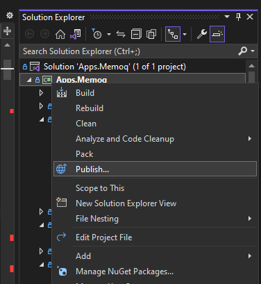
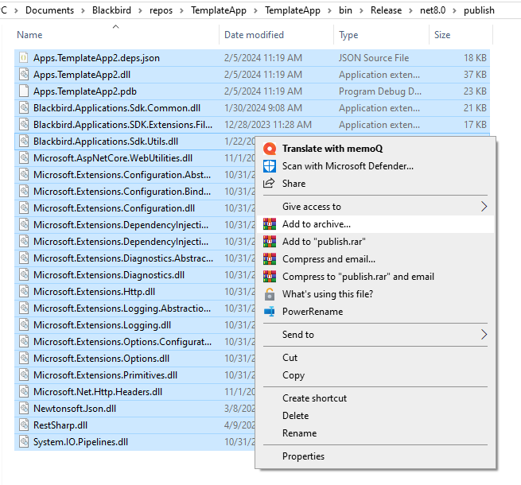
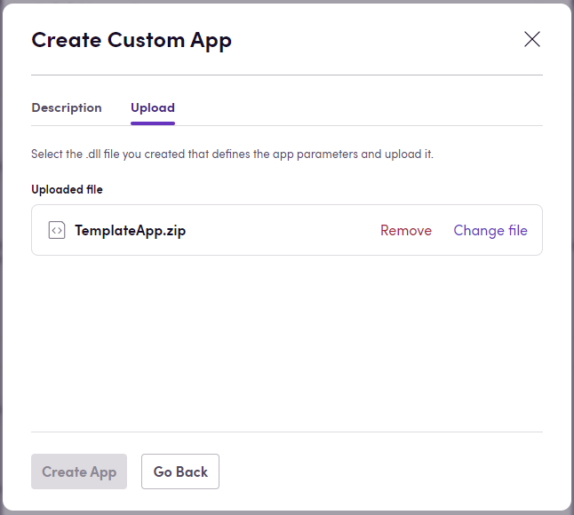

Blackbird apps die je maakt met de SDK kunnen worden geïmplementeerd in je Blackbird organisatie als een _custom app_. Deze handleiding gaat uit van Visual Studio 2022.

## Publiceren

Voordat je een app implementeert, zorg ervoor dat deze minimaal een klasse bevat die `IApplication` implementeert (en optioneel `ICategoryProvider`), een klasse die `IConnectionDefinition` implementeert en een klasse die `IConnectionValidator` implementeert. Als je app acties heeft, zorg er dan voor dat je klassen die acties implementeren het `[ActionList]` attribuut hebben. Als je events hebt, zorg ervoor dat je eventklassen het `[WebhookList]` of `[PollingEventList]` attribuut hebben.

1. Klik met de rechtermuisknop op je project in de solution explorer en klik op _Publish_

2. Als je nog geen publicatieprofiel hebt gemaakt, maak dan een publicatieprofiel aan dat publiceert naar een lokale map.
3. Klik op _Publish_ en vervolgens op _Open folder_
4. Maak een `.zip` archief met **alle** bestanden in deze map

> **Opmerking: Als je op een Mac werkt, zorg ervoor dat je de verborgen _\_MACOSX_ map in het zip-archief verwijdert voordat je het uploadt naar Blackbird.**

## Uploaden

Als je een nieuwe app wilt maken, ga naar _Apps_ -> _My custom apps_ -> Klik op _Create app_. Upload het `.zip` bestand in de tweede stap.

Als je een bestaande app wilt updaten. Klik bij de app die je wilt updaten op _New version_ en vervolgens op _Update App_. Upload het `.zip` bestand naar het scherm dat verschijnt en klik op _Update_.

> Opmerking: Zorg er bij het updaten van een app voor dat de nieuwe versie van de app (gedefinieerd in het `.csproj` bestand) hoger is dan de bestaande versie.

