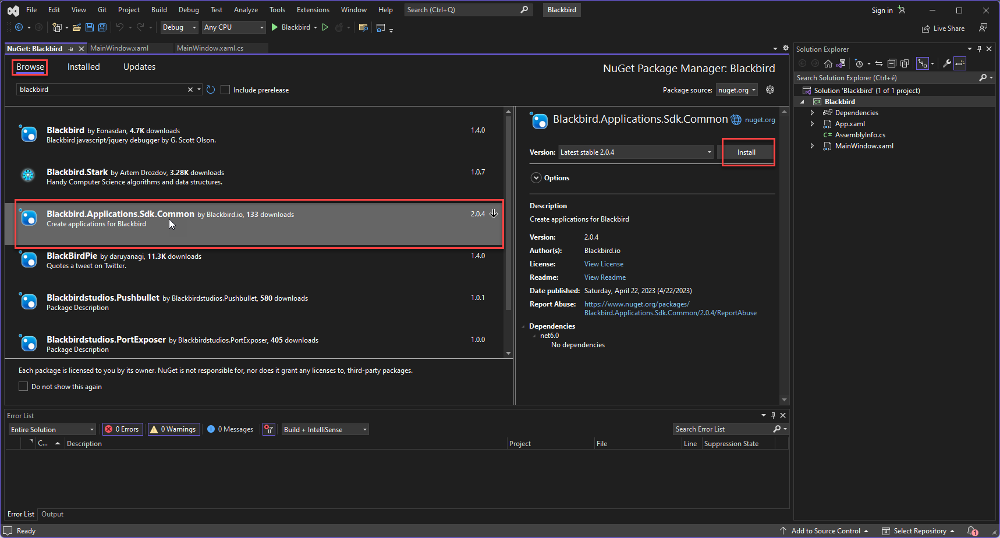

Gebruik je favoriete IDE om een .NET-klassenbibliotheek te maken om je project te starten. Installeer vervolgens onze SDK via NuGet. Je kunt een link naar onze SDK [hier](https://www.nuget.org/packages/Blackbird.Applications.Sdk.Common) vinden of zoek naar 'Blackbird' in de NuGet-pakketbeheerder. Deze handleiding toont je de stappen in Visual Studio 2022 voor Windows. Als alternatief kun je een Blackbird-app maken vanuit een sjabloon.

## Vereisten

- Git geïnstalleerd op je lokale machine. Voor deze tutorial gaan we ervan uit dat je een basiskennis van Git hebt (als je start vanuit een sjabloon).
- Installeer Visual Studio voor Windows met de .NET desktop development workload. Je kunt de 2022 Community-editie gratis [downloaden](https://visualstudio.microsoft.com/) en installeren, of gebruik de Professional- of Enterprise-editie. Als alternatief kun je elke andere .NET IDE-omgeving gebruiken zoals Rider of VS Code met de nodige plugins.
- .NET 8 (of hoger) geïnstalleerd op je machine.

## Vanaf nul

### Een project maken

1. Selecteer in Visual Studio _File > New > Project_.
2. In het venster _Create a new project_, voer _Class Library_ in het zoekvak in en selecteer _C#_ in de vervolgkeuzelijsten. Selecteer in de resulterende lijst met projectsjablonen _Class Library_ en selecteer vervolgens _Next_.
3. In het venster _Configure your new project_, werk de _Project name_ en de _Solution name_ bij en selecteer vervolgens _Next_.
4. Selecteer .NET 8.0 (of de nieuwste versie) voor _Framework_ in het venster _Additional information_, selecteer vervolgens _Create_.

Visual Studio maakt het project aan en het verschijnt in de Solution Explorer.

### De SDK toevoegen

Afhankelijk van je projectformaat registreert de installatie van een NuGet-pakket de afhankelijkheid in je projectbestand of een _packages.config_-bestand. Voor meer informatie, zie Package consumption workflow.

Volg deze stappen om de NuGet Package Manager te gebruiken om het pakket `Blackbird.Applications.Sdk.Common` in Visual Studio te installeren:

1. Selecteer _Project > Manage NuGet Packages_.
2. Op de pagina _NuGet Package Manager_, kies _nuget.org_ als _Package source_.
3. Zoek vanuit het tabblad _Browse_ naar _Blackbird.Applications.Sdk.Common_, selecteer `Blackbird.Applications.Sdk.Common` in de lijst en selecteer vervolgens _Install_.
4. Wanneer je wordt gevraagd om de installatie te verifiëren, selecteer _OK_.



## Vanuit een sjabloon

Kloon de [sjabloon-app repository](https://github.com/bb-io/TemplateApp) vanaf de opdrachtregel met:

```bash
git clone https://github.com/bb-io/TemplateApp.git
```

Open het solution-bestand en verken het project

## Klonen van een bestaande app

Kloon de repository van de app die je wilt wijzigen. Je kunt alle Blackbird-repositories [hier](https://github.com/orgs/bb-io/repositories) vinden.

Bij het implementeren van je wijzigingen doe je dit in een aangepaste app. Zie de [implementatiehandleiding](/blackbird-docs/sdk/deploying). Houd er rekening mee dat je ook de variabelen `Product` en `AssemblyName` in de metadatastructuur moet wijzigen. Zie hieronder.

## Metadatastructuur

Blackbird gebruikt eigenschappen die zijn gedefinieerd in het `.csproj`-bestand om metadatavelden te vullen. Voor de meeste aangepaste apps zijn alleen de Version en AssemblyName relevant (de andere eigenschappen worden gedefinieerd in de UI). Zorg ervoor dat het versienummer hoger is wanneer je een nieuwere versie van een bestaande app uploadt.

