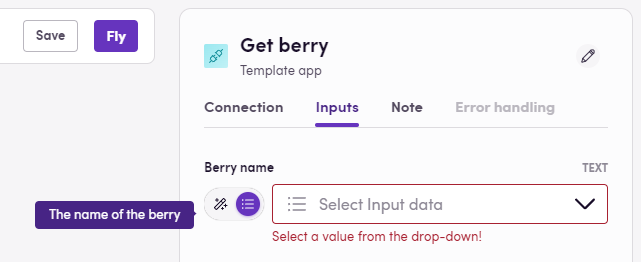

You can use the SDK to define actions that should appear in your app. Contrary to other workflow orchestration platforms, actions in Blackbird don't necessarily correlate 1:1 with an endpoint. Often we tweak the action to be more user-friendly and/or add extra functionality for convenience.

## Pointing Blackbird to actions

Actions in a Blackbird project are defined as methods in a class that has the `ActionList` attribute. These methods will need the `Action` attribute. The basic structure of an action looks like this:

```cs
// To be visible to Blackbird, add the [ActionList] attribute
[ActionList]
public class MyActions : BaseInvocable
{
  // [...]

  // All methods in this class with an [Action] attribute will be visible as actions in Blackbird
  [Action("Translate", Description = "Translate a string")]
  public async Task<TextResult> Translate([ActionParameter] TextTranslationRequest request)
  {
    // Do something here with the request

    return new TextResult{ Translation = "My translation" }
  }
}
```

Arguments of methods that use the `ActionParameter` attributes are inputs of the action in the Bird editor. If the action has no input parameters, the argument might be missing.

The `Action` attribute will take a string as its first argument. This will be the display name of the action in Blackbird. You can also provide an optional Description argument that is displayed in Blackbird.

The fields in the outputted class will automatically be available in the Bird editor in subsequent steps. Action methods can be async - but this is not a requirement.

> Note: The name of your action method cannot be changed, Blackbird would interpret it as a deleted and newly created action.

## Defining display names input values

The `[ActionParameter]` attribute can be added to any acceptable argument (strings, numbers, booleans, dates, lists) but also to classes. When added to the class, Blackbird will simply display all the properties of this class as input arguments.

The `[Display]` attribute can be used on both class properties as well as input arguments to define how the variable should be named in the Blackbird UI. Additionally, a description can be given as well.

```cs
public class GetBerryRequest
{
    // Properties must have display attributes which contain user-friendly name of variable
    [Display("Berry name", Description = "The name of the berry")]
    public string BerryName { get; set; }
}
```

This class is transformed to:



Just as with input arguments, the `[Display]` atribute also works on the return types of your actions in order to give them user-friendly names.

### Ignoring attributes

You can use the `[DefinitionIgnore]` attribute to hide a property from showing up in Blackbird.

```cs
public class BerryResponse
{
    [Display("Berry ID", Description = "The ID of the berry")]
    public string Id { get; set; }

    [Display("Berry name", Description = "The name of the berry")]
    public string Name { get; set; }

    [DefinitionIgnore]
    public string InternalReference { get; set; }
}
```

## Optional inputs

By default all input parameters are required in the Blackbird UI. You can mark any input to be optional simply by making the value nullable (`?` in C#).

```cs
public class CreateCallbackRequest
{
    // This input is now optional
    [Display("Action")] public string? Action { get; set; }
    [Display("Callback URL")] public string CallbackUrl { get; set; }
}
```

## Using your connection

Now that we know how to define custom code that executes when we call an action, let's now also use the connection that we have previously defined.
In Blackbird, any class can inherit from `BaseInvocable`. When this is done, Blackbird passes invocation context to this class when it is instantiated. The context includes handy information like the Bird ID, Flight ID, but most importantly: the authentication credentials.

```cs
[ActionList]
public class MyActions : BaseInvocable
{
  // Create a constructor that passes the InvocationContext
  public MyActions(InvocationContext invocationContext) : base(invocationContext) {}

  [Action("Translate", Description = "Translate a string")]
  public async Task<TextResult> Translate([ActionParameter] TextTranslationRequest request)
  {
    var credentials = InvocationContext.AuthenticationCredentialsProviders;

    // Use the crednetials to make an API request

    return new TextResult{ Translation = "My translation" }
  }
}
```
