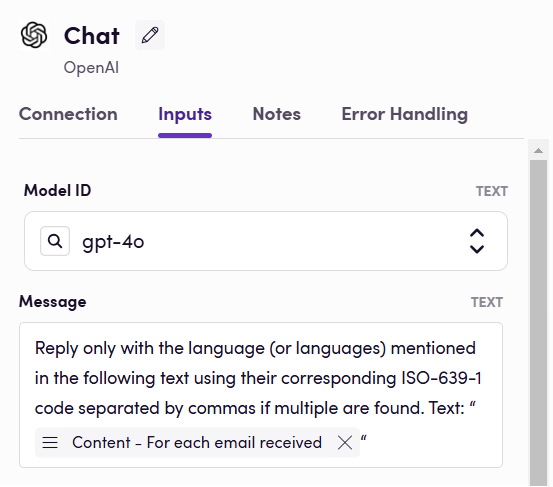

### Eggs: Стартові точки для ваших Birds

У Blackbird.io, Eggs — це шаблони або креслення для ваших робочих процесів. Вони представляють початкові ідеї, які можуть перетворитися на повноцінні Birds.

У цьому посібнику з Egg розглянемо типові випадки використання електронної пошти з допомогою [Microsoft Outlook](https://docs.blackbird.io/apps/microsoft-365-email-outlook/) або [Gmail](https://docs.blackbird.io/apps/gmail/). Знайдіть **Завантажувані Eggs** у кінці — завантажте JSON-робочі процеси для [імпорту до вашого Nest](https://docs.blackbird.io/eggs/emails/#importing-eggs), додайте свої з'єднання, внесіть бажані корективи та **починайте роботу**.

## Опис процесу

1. **Тригер: Отримано електронний лист із вкладеннями**
Щойно отримано електронний лист із прикріпленими файлами, Bird запускається.
2. **Вилучення інформації**
За допомогою регулярних виразів або LLM збирається відповідна інформація. Прикріплені файли завантажуються.
3. **Створення замовлення/проєкту**
Вилучена інформація з тексту електронної пошти використовується для заповнення нового замовлення або проєкту. Файли завантажуються.
4. **Відповідь на електронну пошту**
Деталі нового замовлення/проєкту надсилаються у відповіді. Файли, перекладені машинним перекладом, також можуть бути надіслані як миттєва відповідь.

## Поради

- **Фільтри:** Можна додати кроки прийняття рішень або фільтри, щоб гарантувати, що відбираються лише правильні електронні листи. Наприклад, перевірка, чи містить тема певні попередньо визначені ключові слова. Якщо ви використовуєте додаток [Gmail](https://docs.blackbird.io/apps/gmail/), фільтр можна додати до тригера `On emails received` у формі пошукового запиту.
- **Вилучення інформації:** можна узгодити структуру форми для вилучення інформації за допомогою регулярних виразів. Це може бути схильне до помилок через залежність від людських введень. LLM також можна використовувати для отримання важливих деталей з тексту електронного листа у потрібному форматі.
- **Конвертація мови:** Додатки використовують різні стандарти мовних кодів. [Libraries](https://docs.blackbird.io/concepts/libraries/) допоможуть вирішити ці відмінності.
- **Машинний переклад:** Додатки МП можна використовувати для майже миттєвого повернення перекладених файлів.
- **Оцінка якості:** Можна додати крок прийняття рішення, щоб визначити, чи слід надсилати переклади МП як остаточні або спрямовувати їх на перегляд людиною.
- **Події опитування:** Деякі додатки використовують [polling](https://docs.blackbird.io/concepts/triggers/#polling) замість вебхуків для виявлення нових електронних листів. Перевірте наявність вкладки _Interval_ під час налаштування тригера та виберіть відповідний для вас час (від 5 хвилин до 7 днів).

Egg для отримання електронних листів з Outlook у DeepL та Trados.

Ближчий погляд на відповідь електронною поштою.

Приклад запиту для отримання мовних кодів

Вилучення мовних кодів за допомогою регулярних виразів.

## Завантажити Egg

Завантажте JSON-робочі процеси для імпорту до вашого Nest, внесіть бажані корективи та **починайте роботу**.

- <a href="https://docs.blackbird.io/downloads/Outlook_MT_memoQ.json" download>Електронні листи Outlook до DeepL до memoQ</a>
- <a href="https://docs.blackbird.io//downloads/Outlook_MT_Trados.json" download>Електронні листи Outlook до DeepL до Trados</a>
- <a href="https://docs.blackbird.io//downloads/Gmail_to_quote.json" download>Gmail до комерційної пропозиції</a>

## Імпорт Eggs

Щоб імпортувати Egg до вашого Nest:

1. Перейдіть до розділу Bird Editor.
2. Натисніть на Import у верхньому правому куті.
3. Виберіть файл Egg (JSON) для імпорту та натисніть `Import`.
4. Знайдіть новостворений Bird і натисніть на нього для редагування.
5. Оновіть дані з'єднання та будь-які інші необхідні вхідні/вихідні параметри або бажані кроки. Зверніть увагу на червоні попереджувальні знаки поруч із назвою кроку, які сигналізують про відсутні деталі у цьому кроці.
6. Натисніть Save/Publish.

