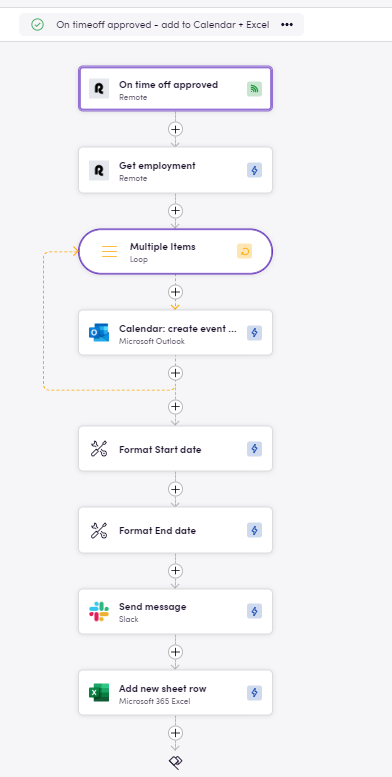

### Eggs: Початкові точки для ваших Birds

У Blackbird, Eggs є зародками або схемами для ваших робочих процесів. Вони представляють початкові ідеї, які мають потенціал стати повноцінними Birds.

У цьому посібнику з Egg розглянемо деякі варіанти інтеграції [Remote.com](https://docs.blackbird.io/apps/remote/) з різними додатками. Знайдіть **Завантажувані Eggs** під кожним випадком використання - завантажте робочі процеси JSON для [імпорту у ваш Nest](https://docs.blackbird.io/eggs/remote/#importing-eggs), додайте свої з'єднання, внесіть будь-які бажані корективи та **злітайте**.

## Випадки використання

### Ресурс TBMS до працевлаштування в Remote

> TBMS стосується систем управління перекладацьким бізнесом. До цієї категорії належать такі програми, як Plunet, XTRF або Bureau Works.

Bird, показаний нижче, створює нове працевлаштування в Remote, як тільки новий ресурс встановлюється як активний в Plunet.

- Завантажити Egg: <a href="https://docs.blackbird.io/downloads/Plunet_resource_activated_to_Remote_Employment.json" download>On Plunet resource activated create Remote employment</a>
- Завантажити Egg: <a href="https://docs.blackbird.io/downloads/Remote_employment_completed_set_Plunet_resource_Active.json" download>On Remote employment completed set Plunet resource active</a>

### Рахунки-фактури TBMS до Remote

Цей Bird запускається щотижня, шукає рахунки-фактури в XTRF, які були оновлені протягом останнього тижня, експортує їх та імпортує в Remote. Зверніть увагу на використання оператора Convert для отримання даних з користувацької бібліотеки.

- Завантажити Egg: <a href="https://docs.blackbird.io/downloads/XTRF_invoice_to_Remote.json" download>XTRF invoice to Remote</a>
- Завантажити Egg: <a href="https://docs.blackbird.io/downloads/Remote_to_XTRF_invoice_status_update.json" download>Remote to XTRF invoice status update</a>

### За тригерами Remote надсилати сповіщення, реєструвати дані, додавати події календаря

Зображення нижче показує Bird, який запускається щоразу, коли запит на відпустку був схвалений в Remote, потім додає подію в календар Microsoft 365, реєструє деталі відпустки в Excel та надсилає сповіщення в Slack.

- Завантажити Egg: <a href="https://docs.blackbird.io/downloads/On_timeoff_approved_add_to_Calendar_Excel.json" download>On timeoff approved add to calendar and Excel</a>
- Завантажити Egg: <a href="https://docs.blackbird.io/downloads/Manual_payout_notification.json" download>Monthly manual payout notification</a>

## Поради

- **Відображення даних між додатками:** Для відображення важливих даних, які відносяться до одного й того ж (наприклад, ID підрядника в Remote та ID ресурсу в Plunet), є різні варіанти використання:
    - [Користувацькі бібліотеки](https://docs.blackbird.io/concepts/libraries/#custom-libraries) можна використовувати для налаштування відображення даних і використовувати їх у ваших Birds через оператор Convert так само, як ви використовували б формулу VLookup в Excel.
    - Користувацькі поля. Багато додатків пропонують користувацькі поля, які можна визначити за вашими потребами.
    - [Пов'язані сутності](https://docs.blackbird.io/guides/entity-linking/).
- **Необов'язкові входи:** Перевірте різні альтернативи введення, особливо на тригерах подій, оскільки вони дають вам можливість фільтрувати, коли запускати Bird. Наприклад, якщо ви використовуєте тригер події "при оновленні статусу", ви, швидше за все, знайдете опцію вказати, який статус повинен запустити процес.

### Імпорт Eggs

Щоб імпортувати Egg у свій Nest:

1. Перейдіть до розділу Bird Editor.
2. Натисніть "Import" у верхньому правому куті.
3. Виберіть файл Egg (JSON) для імпорту та натисніть `Import`.
4. Знайдіть новостворений Bird і натисніть на нього, щоб відредагувати.
5. Оновіть деталі підключення та будь-які інші необхідні параметри введення/виведення або бажані кроки. Шукайте червоні попереджувальні знаки поруч з назвою кроку, які сигналізують про відсутність деталей у цьому кроці.
6. Натисніть "Зберегти/Опублікувати".

