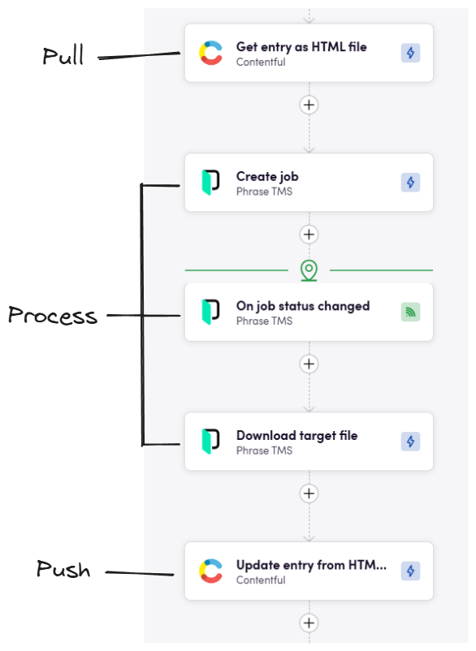
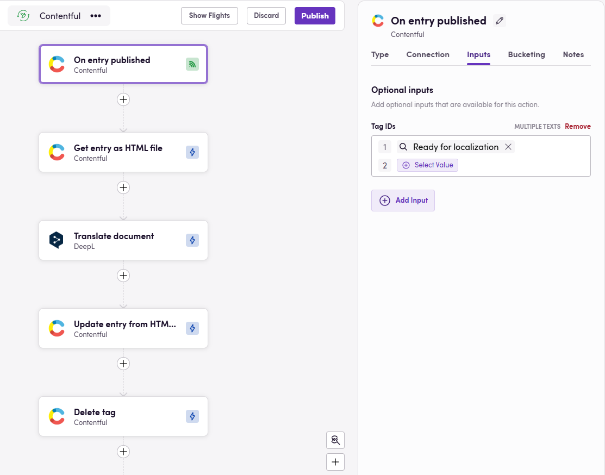
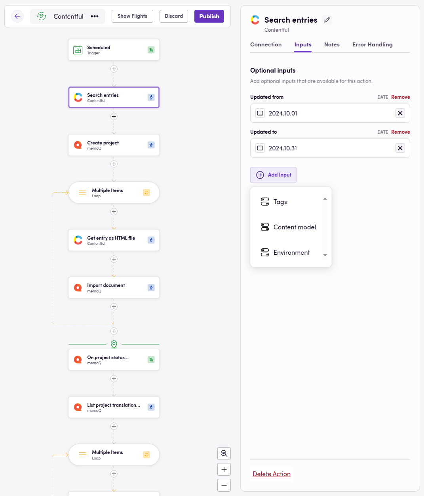

Системи керування контентом (СКК) часто служать центральними вузлами для управління контентом, який може потребувати локалізації або інших типів обробки. Якщо ви використовуєте Blackbird.io, імовірно, ви захочете інтегрувати його з СКК. Цей посібник допоможе вам зрозуміти, як будувати робочі процеси, що зосереджені навколо використання СКК.

Хоча платформи електронної комерції або системи управління інформацією про продукти (PIM) офіційно не вважаються СКК, багато з них пропонують подібні функції. Тому рекомендації в цьому документі також застосовуються і до цих систем.

Ми почнемо з вивчення загальних особливостей СКК та викликів, які вони створюють для локалізації. Потім, використовуючи додаток Contentful як приклад, ми розглянемо різні стратегії для робочих процесів локалізації СКК. Ці стратегії можна застосовувати до будь-якого додатку СКК, доступного на Blackbird.io.

Отже, почнімо!

Перше питання, яке варто поставити при підході до робочого процесу СКК, таке:

>_Чи підтримує ця СКК локалізацію?_

З нашого досвіду відповідь може бути однією з трьох варіантів:

1. Так ([Contentful](/blackbird-docs/apps/contentful), [Zendesk guides](/blackbird-docs/apps/zendesk), [Sitecore](/blackbird-docs/apps/sitecore), [Hubspot blog posts & pages](/blackbird-docs/apps/hubspot-cms) тощо)
2. Так, але тільки з підтримкою популярного плагіна ([WordPress](/blackbird-docs/apps/wordpress), Drupal тощо)
3. Ні ([Marketo](/blackbird-docs/apps/marketo), [Notion](/blackbird-docs/apps/notion), [Hubspot forms & emails](/blackbird-docs/apps/hubspot-cms) тощо)

Коли ваша СКК відноситься до другої чи третьої категорії, потрібно буде більше 'архітектурних рішень', щоб створити найкращий можливий робочий процес з вашою СКК. Також видно, що деякі додатки лише частково підтримують нативну локалізацію (Hubspot), що створює додаткові виклики, коли бажана локалізація всього можливого контенту.

Цей посібник відтепер зосередиться на першому (і найпростішому) з трьох варіантів. Пізніші посібники розглянуть інші варіанти та рішення, але будуть ґрунтуватися на тому, що написано тут.

## 1. Концепції

Система керування контентом зазвичай містить (переважно текстовий) контент, згрупований в **сутність**. Ця сутність залежить від системи. Прикладами сутностей є: *стаття* в Zendesk, *запис* у Contentful, *продукт* у Shopify або *блог-пост* у WordPress. Але WordPress також має *сторінки*, а Shopify також має блог-пости. Це означає, що СКК також може мати різні типи сутностей, що локалізуються.

Те, що групує контент у сутність, зазвичай визначається як "те, що представлене на одній сторінці". Тому ми можемо розглядати цю сутність як синонім сторінки, яку бачить користувач. Сторінки та сутності також зазвичай мають певну ієрархію, яка зазвичай визначається як групи або **категорії** в СКК. Це також полегшує міркування про записи в різних групах чи категоріях. Наприклад, "Я хочу, щоб усі сторінки в категорії FAQ були перекладені".

Сутність містить контент. Цей контент написаний мовою. Отже, сутність повинна мати атрибут **локалі** або мови (Примітка: саме це відсутнє в СКК, які не підтримують локалізацію нативно). Атрибут локалі надзвичайно важливий для нас, оскільки він, найімовірніше, визначатиме, з якої сутності ми витягуємо контент і в яку сутність ми передаємо переклади.

Нарешті, СКК також може мати допоміжні функції, які можуть бути важливими для вашого робочого процесу локалізації, як-от **теги** або **користувацькі поля**.

З цими концепціями ми можемо перейти до наступної частини: визначення основного робочого процесу перекладу.

## 2. Основний робочий процес перекладу

У своїй основі всі робочі процеси, пов'язані з СКК, матимуть таку структуру:

1. Витягнути контент, який потрібно перекласти.
2. Обробити (перекласти) контент у бажані локалі.
3. Передати перекладений контент у правильну комбінацію сутності та локалі.

Ці 3 етапи робочих процесів СКК завжди знайдуть своє місце у ваших birds.

Вам потрібно прийняти найважливіші рішення, які разом з цими 3 етапами сформують ваш bird:

- ❓ Який контент слід витягнути і коли?
- ❓ На які мови слід перекладати?
- ❓ Який додаток або сервіс обробить контент?

Коли ви вирішите ці аспекти, ви побачите, що Blackbird.io подбає про решту, а саме:

- ✔️ Автоматичне перетворення контенту на HTML-файл, який точно відображає вміст сутності, щоб його можна було використовувати для контекстного перекладу TMS або обробки NMT.
- ✔️ Зіставлення мовних кодів між різними системами, необхідними для обробки вашого файлу.
- ✔️ Очікування тривалих кроків обробки або взаємодії з людиною (наприклад, очікування, поки перекладач завершить переклад).
- ✔️ Автоматична передача перекладеного контенту до правильного ID сутності, вбудованого в HTML-файл.

### 2.1 Машинна обробка

Давайте застосуємо цей теоретичний робочий процес на практиці. На зображенні нижче ви бачите приклад етапів витягнення, обробки та передачі з відповідними діями в Contentful. **Get entry as HTML file** використовується для отримання HTML-файлу, що представляє запис. У цьому випадку DeepL використовується для обробки файлу (перекладу його на іншу мову). І нарешті, дія **Update entry from HTML file** використовується для прийняття перекладеного HTML-файлу з DeepL і передачі його назад до Contentful. Звичайно, DeepL можна замінити будь-яким іншим застосунком для однокрокової обробки, і цей робочий процес виглядатиме подібним з іншими СКК.

### 2.2 Людина в оркестрації

Цілком імовірно, що простої машинної обробки недостатньо для ваших потреб локалізації. Обробка вашого файлу, звичайно, може бути багатоетапним процесом. Це майже гарантовано буде у випадку, коли буде якась форма людської взаємодії або нагляду. У наведеному нижче прикладі ми обробляємо файл, надсилаючи його до проекту Phrase TMS і очікуючи завершення перекладу. Ми використовуємо три кроки для досягнення бажаного результату. Спочатку ми створюємо нове завдання, потім очікуємо завершення завдання за допомогою [checkpoint](../../concepts/checkpoints). Потім ми завантажуємо перекладений файл з Phrase TMS перед тим, як передати його назад до Contentful. Будь-яка людина в оркестрації з будь-якою TMS або іншою відповідною системою буде виглядати подібним чином.

> **💡 Примітка**: Перегляньте наш [посібник з концепції checkpoints](../../concepts/checkpoints), щоб дізнатися більше про checkpoints!

## 3. Безперервна локалізація

Ви дізналися, як зазвичай будується основний робочий процес перекладу в bird. Час вирішити перше з трьох великих рішень, які ви можете заповнити самостійно: ❓ *Який контент слід витягнути і коли?*. Варіант використання, для якого Blackbird.io добре підходить, - це безперервна локалізація. Коротко кажучи, процес безперервної локалізації запускає робочі процеси локалізації щоразу, коли створюється новий контент. Ви можете досягти цього за допомогою правильного [trigger](../../concepts/triggers) у Blackbird.io!

Для нашого основного робочого процесу перекладу Contentful нам потрібно лише створити подію, яка запускається, коли створюється новий контент (або публікується в нашому випадку). Потім ми направляємо **Get entry as HTML file** на ID запису, який ми отримуємо з події.

Це все! Безперервна локалізація відмічена. ✔️

Критичний читач, ветеран Contentful або обидва, вкажуть на невеликий недолік у робочому процесі, який ми щойно створили: коли ми публікуємо наш локалізований контент, робочий процес запускається знову, потенційно створюючи нескінченний цикл. - Що ж, капелюх з голови вам. Ця проблема вирішується по-різному в різних СКК. Наприклад, у Zendesk можна фільтрувати подію публікації, щоб слухати лише публікації вихідною мовою. Однак, Contentful не має такої функції, і всі публікації запускатимуть цю подію.

Ми рекомендуємо вивчити допоміжні функції, які мають СКК, такі як **теги** або **користувацькі поля**, як згадувалося раніше. Популярний спосіб вирішення цього в Contentful - використання системи тегів. Ви можете додати фільтри до подій запису в Blackbird.io, щоб тільки записи з певним тегом запускали bird. Хорошим кандидатом може бути *Ready for localization*. Обов'язково видаліть тег в кінці вашого робочого процесу!

## 4. Планова та історична локалізація

Можливо, безперервна локалізація не зовсім відповідає вашим потребам. Можливо, ви зацікавлені в більш традиційному робочому процесі локалізації, де ви беретете новий контент для перекладу за повторюваним графіком, наприклад, раз на тиждень. Або, можливо, ви хочете використовувати безперервну локалізацію, але також потрібно обробляти сутності, які були опубліковані в минулому. В обох випадках вам потрібен інший підхід до ❓ *Який контент слід витягнути і коли?* Коли буде або запланований тригер, або ручний тригер (коли ви натискаєте кнопку 'Fly' у вашому bird). А що буде визначатися іншою дією.

Кожна СКК має дію у формі *Search entities*, яку можна використовувати для пошуку та вибору точного контенту, який ви хочете обробити. Вона зазвичай поставляється з різними фільтрами, включаючи фільтри *Updated from* та *Updated to*, які можна використовувати для вибору часового діапазону, в якому контент може бути оновлено.

## 5. Обробка кількох мов

Досі кожен bird, який ми бачили, перекладав контент лише однією мовою. Однак, цілком імовірно, що ви насправді хочете перекладати на кілька мов. У цьому розділі ми займаємося питанням ❓